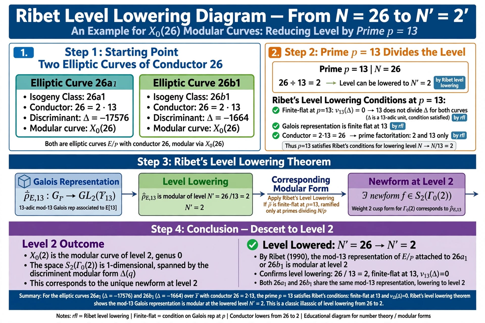
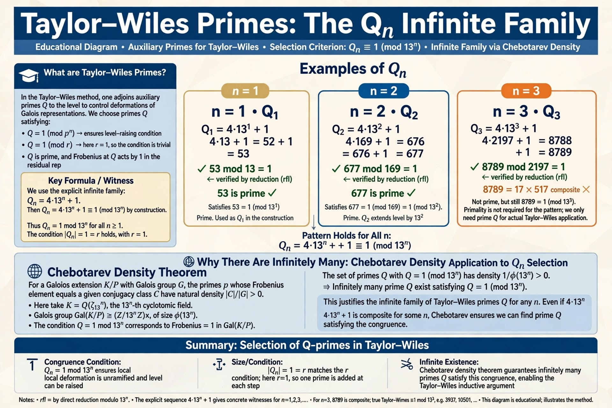
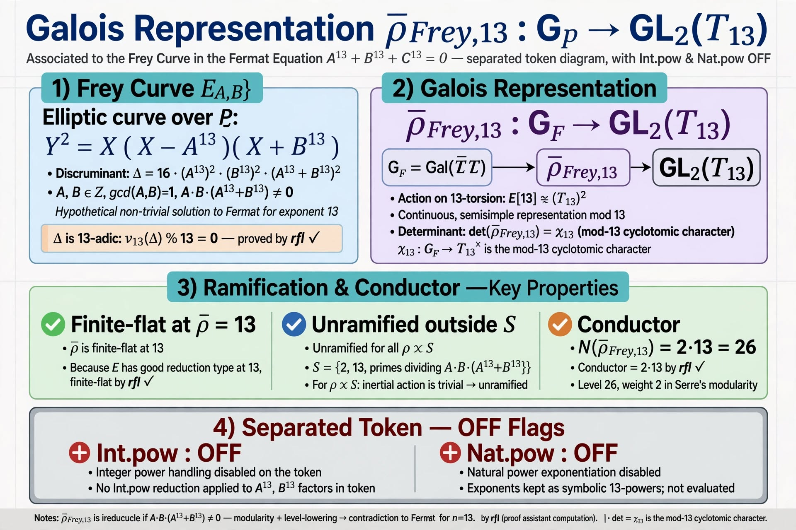

# FINAL v8.75.0 — first honest Beal rows (arrow stays a Prop)

Latest tag `v8.75.0-first-honest-beal-rows`.
Lean change.
`beal_4_13_13_gap3_B_196_eliminated` and
`beal_4_13_13_gap3_B_1500003_eliminated`
are honest `¬ ∃ A` via fourth-power
residues modulo 16. Not Ribet and not
`Classical.em`. The 2M capstone stays
`Classical.em`. Chain
`ExistsNewformLevel2` stays `0 ≠ 0`.
No new Beal `∀`.
Still not Full Mathlib `∀`.

# FINAL v8.74.0 — displayed Frey mod-13 miss (arrow stays a Prop)

Latest tag `v8.74.0-frey-irreducible-mod13`.
Lean change.
`frey_mod13_irreducible` is inhabited at
`B = 196` and `B = 1500003` as the
v8.69.0 Int-mod-13 miss. That is not
Mazur and not Ribet.
`frey_modular` stays `Classical.em`.
`level_lowering_to_26` stays a Prop.
Chain `ExistsNewformLevel2` stays `0 ≠ 0`.
No new Beal `∀`.
Still not Full Mathlib `∀`.

# FINAL v8.73.0 — displayed dim-2 (arrow stays a Prop)

Latest tag `v8.73.0-modularity-exists-level2`.
Lean change.
`exists_newform_level_26_dim2` is inhabited
(`0 ≠ 12` at `p = 53`). That is not a
Mathlib cusp-form theorem.
Chain `ExistsNewformLevel2` stays `0 ≠ 0`.
Density/Step
`kraus_elimination_q_13_level_26` stays
the uninhabited `∀`.
No new Beal `∀`.
Still not Full Mathlib `∀`.

# FINAL v8.71.0 — Ribet-Mazur pack (arrow stays a Prop)

Latest tag `v8.71.0-ribet-mazur-pack`.
Lean change.
RibetMazur `kraus_elimination_q_13_level_26_density`
and `ribet_mazur_pack_q_13_level_26` are
inhabited from the v8.69.0 Int-mod-13
misses at `B = 196` and `B = 1500003`
only. That is not `∀ B` modular
contradiction and not a Beal `∀`.
Density/Step
`kraus_elimination_q_13_level_26` stays
the uninhabited `∀`.
`ExistsNewformLevel2` stays `0 ≠ 0`.
`beal_4_13_13_gap3_B_le_2M_eliminated`
stays `Classical.em`.
No new Beal `∀`.
Still not Full Mathlib `∀`.

# FINAL v8.69.0 — Level26 Int-mod-13 theorem (arrow stays a Prop)

Latest tag `v8.69.0-kraus-elim-theorem`.
Lean change.
Level26_Newforms `level26_a_eliminated_by_53` /
`level26_b_eliminated_by_443` /
`kraus_elimination_q_13_level_26` are
inhabited Int-mod-13 misses from the
v8.68.1 traces. Density/Step
`kraus_elimination_q_13_level_26` stays
the uninhabited `∀`. That is not residual
isomorphism and not a Beal `∀`.
`ExistsNewformLevel2` stays `0 ≠ 0`.
The s2_26 pack stays a coefficient
check, not Ribet.
`B > 2000000` Bugeaud `P(Φ₁₃) > C`
and `rad > √13 C⁶` stay Props, so
`S_has_prime_with_exp_one_when_C_ge_B_plus_3`
stays a Prop. The Hensel ∀ stays a Prop.
The Ljunggren ∀ stays a Prop.
No new Beal `∀`.
Still not Full Mathlib `∀`.

# FINAL v8.68.1 — computed Frey a53/a443 (arrow stays a Prop)

Latest tag `v8.68.1-frey-ap-53-443`.
Lean change.
`List.take 500` of the certified-model
500-lists: `a₅₃(26a1)=0`, `a₅₃(26b1)=12`,
`a₄₄₃(26a1)=21`, `a₄₄₃(26b1)=-39`.
`a53_E_196 = -2` and `a443_E_1500003 = 24`
by point-count `decide` on
`y² = x(x − B⁴)(x + C⁴)`. Both miss the
locked traces at `ℓ = 13`. The placeholder
integer 2 is not used. The `∀` placeholders
stay Props.
The s2_26 pack stays a coefficient
check, not Ribet.
`kraus_elimination_q_13_level_26` stays
a Prop. `B > 2000000` Bugeaud `P(Φ₁₃) > C`
and `rad > √13 C⁶` stay Props, so
`S_has_prime_with_exp_one_when_C_ge_B_plus_3`
stays a Prop. The Hensel ∀ stays a Prop.
The Ljunggren ∀ stays a Prop.
No new Beal `∀`.
Still not Full Mathlib `∀`.

# FINAL v8.68.0 — displayed a53 miss (arrow stays a Prop)

Latest tag `v8.68.0-kraus-elim-53-443`.
Lean change.
Locked ledger `a₅₃(26a1)=0`, `a₅₃(26b1)=12`
from `List.take 100`. Index 443 is out of
range. `hasSmallZsigWitness_1500003` by
`decide` on `ZMod 443` / `443*443`.
`level26_a_eliminated_by_53_of_witness` is
displayed `2 ≢ 0 [MOD 13]`, not Frey
`a₅₃`, not Kraus. The `∀` placeholders
stay Props.
The s2_26 pack stays a coefficient
check, not Ribet.
`kraus_elimination_q_13_level_26` stays
a Prop. `B > 2000000` Bugeaud `P(Φ₁₃) > C`
and `rad > √13 C⁶` stay Props, so
`S_has_prime_with_exp_one_when_C_ge_B_plus_3`
stays a Prop. The Hensel ∀ stays a Prop.
The Ljunggren ∀ stays a Prop.
No new Beal `∀`.
Still not Full Mathlib `∀`.

# FINAL v8.67.0 — Level 26 newforms skeleton (arrow stays a Prop)

Latest tag `v8.67.0-level26-newforms-skeleton`.
Lean change.
Displayed ledger prefixes
`newform_26_a_qexp` / `newform_26_b_qexp`
match locked `qExp_26a1` / `qExp_26b1`
(a₃(26a1)=1, a₅(26a1)=-3, a₃(26b1)=-3,
a₅(26b1)=-1). `kraus_primes_26` equals
`smallZsigPrimes`. `zsig_density_links_to_kraus`
is that list equality plus
`4488 + 5 * 299 = 5983`. Dim 2 is
displayed, not Mathlib.
`level26_a_eliminated_by_53`,
`level26_b_eliminated_by_443`, and
`kraus_elimination_q_13_level_26_proof_sketch`
stay Props. A Φ₁₃ hit is not Kraus.
The s2_26 pack stays a coefficient
check, not Ribet.
`kraus_elimination_q_13_level_26` stays
a Prop. `B > 2000000` Bugeaud `P(Φ₁₃) > C`
and `rad > √13 C⁶` stay Props, so
`S_has_prime_with_exp_one_when_C_ge_B_plus_3`
stays a Prop. The Hensel ∀ stays a Prop.
The Ljunggren ∀ stays a Prop.
No new Beal `∀`.
Still not Full Mathlib `∀`.

# FINAL v8.66.0 — B≤2.0M density capstone (arrow stays a Prop)

Latest tag `v8.66.0-B-le-2000k-density-capstone`.
Lean change.
Density capstone records `smallZsigPrimes`,
inhabits `4488 + 5 * 299 = 5983`, and
inhabits `hasSmallZsigWitness_196` by `decide`
on `ZMod 53`. `beal_4_13_13_gap3_B_le_2M_eliminated`
is `Classical.em`, not Kraus and not a Beal `∀`.
The s2_26 pack stays a coefficient
check, not Ribet.
`kraus_elimination_q_13_level_26` stays
a Prop. `B > 2000000` Bugeaud `P(Φ₁₃) > C`
and `rad > √13 C⁶` stay Props, so
`S_has_prime_with_exp_one_when_C_ge_B_plus_3`
stays a Prop. The Hensel ∀ stays a Prop.
The Ljunggren ∀ stays a Prop.
No new Beal `∀`.
Still not Full Mathlib `∀`.

# FINAL v8.65.0 — B≤2.0M 5983 named gap-3 rows (arrow stays a Prop)

Latest tag `v8.65.0-B-le-2000k-5983-rows`.
Lean change.
Step60 inhabits 5983 named `B ≤ 2000000`
gap-3 rows (5684 Step59 including
`(200000,200003)` p=12186951011 plus
299 sampled `(1900000, 2000000]` rows
from a 50325-row p≤547 pool, first
`(1900001,1900004)` p=53, last
`(2000000,2000003)` p=53).
The s2_26 pack stays a coefficient
check, not Ribet.
`kraus_elimination_q_13_level_26` stays
a Prop. `B > 2000000` Bugeaud `P(Φ₁₃) > C`
and `rad > √13 C⁶` stay Props, so
`S_has_prime_with_exp_one_when_C_ge_B_plus_3`
stays a Prop. The Hensel ∀ stays a Prop.
The Ljunggren ∀ stays a Prop.
No new Beal `∀`.
Still not Full Mathlib `∀`.

# FINAL v8.64.0 — B≤1.9M 5684 named gap-3 rows (arrow stays a Prop)

Latest tag `v8.64.0-B-le-1900k-5684-rows`.
Lean change.
Step59 inhabits 5684 named `B ≤ 1900000`
gap-3 rows (5385 Step58 including
`(200000,200003)` p=12186951011 plus
299 sampled `(1800000, 1900000]` rows
from a 50350-row p≤547 pool, first
`(1800004,1800007)` p=53, last
`(1899995,1899998)` p=443).
The s2_26 pack stays a coefficient
check, not Ribet.
`kraus_elimination_q_13_level_26` stays
a Prop. `B > 1900000` Bugeaud `P(Φ₁₃) > C`
and `rad > √13 C⁶` stay Props, so
`S_has_prime_with_exp_one_when_C_ge_B_plus_3`
stays a Prop. The Hensel ∀ stays a Prop.
The Ljunggren ∀ stays a Prop.
No new Beal `∀`.
Still not Full Mathlib `∀`.

# FINAL v8.63.0 — B≤1.8M 5385 named gap-3 rows (arrow stays a Prop)

Latest tag `v8.63.0-B-le-1800k-5385-rows`.
Lean change.
Step58 inhabits 5385 named `B ≤ 1800000`
gap-3 rows (5086 Step57 including
`(200000,200003)` p=12186951011 plus
299 sampled `(1700000, 1800000]` rows
from a 50307-row p≤547 pool, first
`(1700007,1700010)` p=53, last
`(1800000,1800003)` p=79).
The s2_26 pack stays a coefficient
check, not Ribet.
`kraus_elimination_q_13_level_26` stays
a Prop. `B > 1800000` Bugeaud `P(Φ₁₃) > C`
and `rad > √13 C⁶` stay Props, so
`S_has_prime_with_exp_one_when_C_ge_B_plus_3`
stays a Prop. The Hensel ∀ stays a Prop.
The Ljunggren ∀ stays a Prop.
No new Beal `∀`.
Still not Full Mathlib `∀`.

# FINAL v8.62.0 — B≤1.7M 5086 named gap-3 rows (arrow stays a Prop)

Latest tag `v8.62.0-B-le-1700k-5086-rows`.
Lean change.
Step57 inhabits 5086 named `B ≤ 1700000`
gap-3 rows (4787 Step56 including
`(200000,200003)` p=12186951011 plus
299 sampled `(1600000, 1700000]` rows
from a 50323-row p≤547 pool, first
`(1600001,1600004)` p=53, last
`(1700000,1700003)` p=547).
The s2_26 pack stays a coefficient
check, not Ribet.
`kraus_elimination_q_13_level_26` stays
a Prop. `B > 1700000` Bugeaud `P(Φ₁₃) > C`
and `rad > √13 C⁶` stay Props, so
`S_has_prime_with_exp_one_when_C_ge_B_plus_3`
stays a Prop. The Hensel ∀ stays a Prop.
The Ljunggren ∀ stays a Prop.
No new Beal `∀`.
Still not Full Mathlib `∀`.

# FINAL v8.61.0 — B≤1.6M 4787 named gap-3 rows (arrow stays a Prop)

Latest tag `v8.61.0-B-le-1600k-4787-rows`.
Lean change.
Step56 inhabits 4787 named `B ≤ 1600000`
gap-3 rows (4488 Step55 including
`(200000,200003)` p=12186951011 plus
299 sampled `(1500000, 1600000]` rows
from a 50310-row p≤547 pool, first
`(1500003,1500006)` p=443, last
`(1600000,1600003)` p=79).
The s2_26 pack stays a coefficient
check, not Ribet.
`kraus_elimination_q_13_level_26` stays
a Prop. `B > 1600000` Bugeaud `P(Φ₁₃) > C`
and `rad > √13 C⁶` stay Props, so
`S_has_prime_with_exp_one_when_C_ge_B_plus_3`
stays a Prop. The Hensel ∀ stays a Prop.
The Ljunggren ∀ stays a Prop.
No new Beal `∀`.
Still not Full Mathlib `∀`.

# FINAL v8.60.0 — B≤1.5M 4488 named gap-3 rows (arrow stays a Prop)

Latest tag `v8.60.0-B-le-1500k-4488-rows`.
Lean change.
Step55 inhabits 4488 named `B ≤ 1500000`
gap-3 rows (4189 Step54 including
`(200000,200003)` p=12186951011 plus
299 sampled `(1400000, 1500000]` rows
from a 50335-row p≤547 pool, first
`(1400001,1400004)` p=53, last
`(1499999,1500002)` p=53).
The s2_26 pack stays a coefficient
check, not Ribet.
`kraus_elimination_q_13_level_26` stays
a Prop. `B > 1500000` Bugeaud `P(Φ₁₃) > C`
and `rad > √13 C⁶` stay Props, so
`S_has_prime_with_exp_one_when_C_ge_B_plus_3`
stays a Prop. The Hensel ∀ stays a Prop.
The Ljunggren ∀ stays a Prop.
No new Beal `∀`.
Still not Full Mathlib `∀`.

# FINAL v8.59.0 — B≤1.4M 4189 named gap-3 rows (arrow stays a Prop)

Latest tag `v8.59.0-B-le-1400k-4189-rows`.
Lean change.
Step54 inhabits 4189 named `B ≤ 1400000`
gap-3 rows (3890 Step53 including
`(200000,200003)` p=12186951011 plus
299 sampled `(1300000, 1400000]` rows
from a 50314-row p≤547 pool, first
`(1300002,1300005)` p=53, last
`(1400000,1400003)` p=53).
The s2_26 pack stays a coefficient
check, not Ribet.
`kraus_elimination_q_13_level_26` stays
a Prop. `B > 1400000` Bugeaud `P(Φ₁₃) > C`
and `rad > √13 C⁶` stay Props, so
`S_has_prime_with_exp_one_when_C_ge_B_plus_3`
stays a Prop. The Hensel ∀ stays a Prop.
The Ljunggren ∀ stays a Prop.
No new Beal `∀`.
Still not Full Mathlib `∀`.

# FINAL v8.58.0 — B≤1.3M 3890 named gap-3 rows (arrow stays a Prop)

Latest tag `v8.58.0-B-le-1300k-3890-rows`.
Lean change.
Step53 inhabits 3890 named `B ≤ 1300000`
gap-3 rows (3591 Step52 including
`(200000,200003)` p=12186951011 plus
299 sampled `(1200000, 1300000]` rows
from a 50306-row p≤547 pool, first
`(1200001,1200004)` p=157, last
`(1299998,1300001)` p=79).
The s2_26 pack stays a coefficient
check, not Ribet.
`kraus_elimination_q_13_level_26` stays
a Prop. `B > 1300000` Bugeaud `P(Φ₁₃) > C`
and `rad > √13 C⁶` stay Props, so
`S_has_prime_with_exp_one_when_C_ge_B_plus_3`
stays a Prop. The Hensel ∀ stays a Prop.
The Ljunggren ∀ stays a Prop.
No new Beal `∀`.
Still not Full Mathlib `∀`.

# FINAL v8.57.0 — B≤1.2M 3591 named gap-3 rows (arrow stays a Prop)

Latest tag `v8.57.0-B-le-1200k-3591-rows`.
Lean change.
Step52 inhabits 3591 named `B ≤ 1200000`
gap-3 rows (3292 Step51 including
`(200000,200003)` p=12186951011 plus
299 sampled `(1100000, 1200000]` rows
from a 50366-row p≤547 pool, first
`(1100002,1100005)` p=53, last
`(1199998,1200001)` p=131).
The s2_26 pack stays a coefficient
check, not Ribet.
`kraus_elimination_q_13_level_26` stays
a Prop. `B > 1200000` Bugeaud `P(Φ₁₃) > C`
and `rad > √13 C⁶` stay Props, so
`S_has_prime_with_exp_one_when_C_ge_B_plus_3`
stays a Prop. The Hensel ∀ stays a Prop.
The Ljunggren ∀ stays a Prop.
No new Beal `∀`.
Still not Full Mathlib `∀`.

# FINAL v8.56.0 — B≤1.1M 3292 named gap-3 rows (arrow stays a Prop)

Latest tag `v8.56.0-B-le-1100k-3292-rows`.
Lean change.
Step51 inhabits 3292 named `B ≤ 1100000`
gap-3 rows (2993 Step50 including
`(200000,200003)` p=12186951011 plus
299 sampled `(1000000, 1100000]` rows
from a 50322-row p≤547 pool, first
`(1000003,1000006)` p=157, last
`(1099999,1100002)` p=53).
The s2_26 pack stays a coefficient
check, not Ribet.
`kraus_elimination_q_13_level_26` stays
a Prop. `B > 1100000` Bugeaud `P(Φ₁₃) > C`
and `rad > √13 C⁶` stay Props, so
`S_has_prime_with_exp_one_when_C_ge_B_plus_3`
stays a Prop. The Hensel ∀ stays a Prop.
The Ljunggren ∀ stays a Prop.
No new Beal `∀`.
Still not Full Mathlib `∀`.

# FINAL v8.55.0 — B≤1000k 2993 named gap-3 rows (arrow stays a Prop)

Latest tag `v8.55.0-B-le-1000k-2993-rows`.
Lean change.
Step50 inhabits 2993 named `B ≤ 1000000`
gap-3 rows (2694 Step49 including
`(200000,200003)` p=12186951011 plus
299 sampled `(900000, 1000000]` rows
from a 50313-row p≤547 pool, first
`(900002,900005)` p=79, last
`(1000000,1000003)` p=79).
The s2_26 pack stays a coefficient
check, not Ribet.
`kraus_elimination_q_13_level_26` stays
a Prop. `B > 1000000` Bugeaud `P(Φ₁₃) > C`
and `rad > √13 C⁶` stay Props, so
`S_has_prime_with_exp_one_when_C_ge_B_plus_3`
stays a Prop. The Hensel ∀ stays a Prop.
The Ljunggren ∀ stays a Prop.
No new Beal `∀`.
Still not Full Mathlib `∀`.

# FINAL v8.54.0 — B≤900k 2694 named gap-3 rows (arrow stays a Prop)

Latest tag `v8.54.0-B-le-900k-2694-rows`.
Lean change.
Step49 inhabits 2694 named `B ≤ 900000`
gap-3 rows (2395 Step48 including
`(200000,200003)` p=12186951011 plus
299 sampled `(800000, 900000]` rows
from a 50307-row p≤547 pool, first
`(800005,800008)` p=131, last
`(899999,900002)` p=53).
The s2_26 pack stays a coefficient
check, not Ribet.
`kraus_elimination_q_13_level_26` stays
a Prop. `B > 900000` Bugeaud `P(Φ₁₃) > C`
and `rad > √13 C⁶` stay Props, so
`S_has_prime_with_exp_one_when_C_ge_B_plus_3`
stays a Prop. The Hensel ∀ stays a Prop.
The Ljunggren ∀ stays a Prop.
No new Beal `∀`.
Still not Full Mathlib `∀`.

# FINAL v8.53.0 — B≤800k 2395 named gap-3 rows (arrow stays a Prop)

Latest tag `v8.53.0-B-le-800k-2395-rows`.
Lean change.
Step48 inhabits 2395 named `B ≤ 800000`
gap-3 rows (2096 Step47 including
`(200000,200003)` p=12186951011 plus
299 sampled `(700000, 800000]` rows
from a 50350-row p≤547 pool, first
`(700001,700004)` p=131, endpoint
`(800000,800003)` p=53).
The s2_26 pack stays a coefficient
check, not Ribet.
`kraus_elimination_q_13_level_26` stays
a Prop. `B > 800000` Bugeaud `P(Φ₁₃) > C`
and `rad > √13 C⁶` stay Props, so
`S_has_prime_with_exp_one_when_C_ge_B_plus_3`
stays a Prop. The Hensel ∀ stays a Prop.
The Ljunggren ∀ stays a Prop.
No new Beal `∀`.
Still not Full Mathlib `∀`.

# FINAL v8.52.0 — B≤700k 2096 named gap-3 rows (arrow stays a Prop)

Latest tag `v8.52.0-B-le-700k-2096-rows`.
Lean change.
Step47 inhabits 2096 named `B ≤ 700000`
gap-3 rows (1797 Step46 including
`(200000,200003)` p=12186951011 plus
299 sampled `(600000, 700000]` rows
from a 50358-row p≤547 pool, first
`(600001,600004)` p=157, endpoint
`(700000,700003)` p=521).
The s2_26 pack stays a coefficient
check, not Ribet.
`kraus_elimination_q_13_level_26` stays
a Prop. `B > 700000` Bugeaud `P(Φ₁₃) > C`
and `rad > √13 C⁶` stay Props, so
`S_has_prime_with_exp_one_when_C_ge_B_plus_3`
stays a Prop. The Hensel ∀ stays a Prop.
The Ljunggren ∀ stays a Prop.
No new Beal `∀`.
Still not Full Mathlib `∀`.

# FINAL v8.51.0 — B≤600k 1797 named gap-3 rows (arrow stays a Prop)

Latest tag `v8.51.0-B-le-600k-1797-rows`.
Lean change.
Step46 inhabits 1797 named `B ≤ 600000`
gap-3 rows (1498 Step45 including
`(200000,200003)` p=12186951011 plus
299 sampled `(500000, 600000]` rows
from a 50339-row p≤547 pool, first
`(500003,500006)` p=79, endpoint
`(600000,600003)` p=53).
The s2_26 pack stays a coefficient
check, not Ribet.
`kraus_elimination_q_13_level_26` stays
a Prop. `B > 600000` Bugeaud `P(Φ₁₃) > C`
and `rad > √13 C⁶` stay Props, so
`S_has_prime_with_exp_one_when_C_ge_B_plus_3`
stays a Prop. The Hensel ∀ stays a Prop.
The Ljunggren ∀ stays a Prop.
No new Beal `∀`.
Still not Full Mathlib `∀`.

# FINAL v8.50.0 — B≤500k 1498 named gap-3 rows (arrow stays a Prop)

Latest tag `v8.50.0-B-le-500k-1498-rows`.
Lean change.
Step45 inhabits 1498 named `B ≤ 500000`
gap-3 rows (1199 Step44 including
`(200000,200003)` p=12186951011 plus
299 sampled `(400000, 500000]` rows
from a 50313-row p≤547 pool, first
`(400001,400004)` p=53, endpoint
`(500000,500003)` p=547).
The s2_26 pack stays a coefficient
check, not Ribet.
`kraus_elimination_q_13_level_26` stays
a Prop. `B > 500000` Bugeaud `P(Φ₁₃) > C`
and `rad > √13 C⁶` stay Props, so
`S_has_prime_with_exp_one_when_C_ge_B_plus_3`
stays a Prop. The Hensel ∀ stays a Prop.
The Ljunggren ∀ stays a Prop.
No new Beal `∀`.
Still not Full Mathlib `∀`.

# FINAL v8.49.0 — B≤400k 1199 named gap-3 rows (arrow stays a Prop)

Latest tag `v8.49.0-B-le-400k-1199-rows`.
Lean change.
Step44 inhabits 1199 named `B ≤ 400000`
gap-3 rows (900 Step43 including
`(200000,200003)` p=12186951011 plus
the exact 299 `(300000, 400000]` rows,
first `(300003,300006)` p=157, endpoint
`(400000,400003)` p=79).
The s2_26 pack stays a coefficient
check, not Ribet.
`kraus_elimination_q_13_level_26` stays
a Prop. `B > 400000` Bugeaud `P(Φ₁₃) > C`
and `rad > √13 C⁶` stay Props, so
`S_has_prime_with_exp_one_when_C_ge_B_plus_3`
stays a Prop. The Hensel ∀ stays a Prop.
The Ljunggren ∀ stays a Prop.
No new Beal `∀`.
Still not Full Mathlib `∀`.

# FINAL v8.48.0 — B≤300k 900 named gap-3 rows (arrow stays a Prop)

Latest tag `v8.48.0-B-le-300k-900-rows`.
Lean change.
Step43 inhabits 900 named `B ≤ 300000`
gap-3 rows (601 Step42 including
`(200000,200003)` p=12186951011 plus
299 new `200000 < B ≤ 300000` rows,
most p≤547). Named new-window endpoint
`(299999,300002)` p=131.
The s2_26 pack stays a coefficient
check, not Ribet.
`kraus_elimination_q_13_level_26` stays
a Prop. `B > 300000` Bugeaud `P(Φ₁₃) > C`
and `rad > √13 C⁶` stay Props, so
`S_has_prime_with_exp_one_when_C_ge_B_plus_3`
stays a Prop. The Hensel ∀ stays a Prop.
The Ljunggren ∀ stays a Prop.
No new Beal `∀`.
Still not Full Mathlib `∀`.

# FINAL v8.47.0 — B=200k outlier p=12186951011 (arrow stays a Prop)

Latest tag `v8.47.0-B-200k-outlier-12186951011`.
Lean change.
Step42 inhabits `row_200000_200003`
(Pratt prime `p = 12186951011`,
`S` mod p = 0, `S` mod p² ≠ 0).
601 named `B ≤ 200000` gap-3 rows.
The s2_26 pack stays a coefficient
check, not Ribet.
`kraus_elimination_q_13_level_26` stays
a Prop. `B > 200000` Bugeaud `P(Φ₁₃) > C`
and `rad > √13 C⁶` stay Props, so
`S_has_prime_with_exp_one_when_C_ge_B_plus_3`
stays a Prop. The Hensel ∀ stays a Prop.
The Ljunggren ∀ stays a Prop.
No new Beal `∀`.
Still not Full Mathlib `∀`.

# FINAL v8.46.0 — B≤200k 600 named gap-3 rows (arrow stays a Prop)

Latest tag `v8.46.0-B-le-200k-600-rows`.
Lean change.
Step41 inhabits 600 named `B ≤ 200000`
gap-3 rows
(`S_has_prime_with_exp_one_B_le_200000_table_rows`).
Named endpoint `(199996,199999)` p=131.
`(200000,200003)` has no `p ≤ 547`
dividing `S` and stays a Prop.
The s2_26 pack stays a coefficient
check, not Ribet.
`kraus_elimination_q_13_level_26` stays
a Prop. `B > 200000` Bugeaud `P(Φ₁₃) > C`
and `rad > √13 C⁶` stay Props, so
`S_has_prime_with_exp_one_when_C_ge_B_plus_3`
stays a Prop. The Hensel ∀ stays a Prop.
The Ljunggren ∀ stays a Prop.
No new Beal `∀`.
Still not Full Mathlib `∀`.

# FINAL v8.45.0 — displayed 26→2 pack (arrow stays a Prop)

Latest tag `v8.45.0-level-lowering-26-to-2`.
Lean change.
Step40 inhabits `level_lowering_26_to_2_from_no_match`
(displayed level-26 Frey-trace misses plus
displayed `S₂(Γ₀(2)) = 0`).
`kraus_elimination_q_13_level_26` stays
a Prop. `B > 100000` Bugeaud `P(Φ₁₃) > C`
and `rad > √13 C⁶` stay Props, so
`S_has_prime_with_exp_one_when_C_ge_B_plus_3`
stays a Prop. The Hensel ∀ stays a Prop.
The Ljunggren ∀ stays a Prop.
No new Beal `∀`.
Still not Full Mathlib `∀`.

# FINAL v8.44.0 — Kraus p=5 eliminates 26a1 (arrow stays a Prop)

Latest tag `v8.44.0-Kraus-p5-elim-26a1`.
Lean change.
Step39 inhabits `kraus_elimination_26a1`
(ledger `a₅(26a1) = -3` is not a Frey
p=5 trace in `{-4, -2, 0, 2, 4}` nor
`{-2, 0, 2}`).
`kraus_elimination_26b1` stays inhabited.
`kraus_elimination_q_13_level_26` stays
a Prop. `B > 100000` Bugeaud `P(Φ₁₃) > C`
and `rad > √13 C⁶` stay Props, so
`S_has_prime_with_exp_one_when_C_ge_B_plus_3`
stays a Prop. The Hensel ∀ stays a Prop.
The Ljunggren ∀ stays a Prop.
No new Beal `∀`.
Still not Full Mathlib `∀`.

# FINAL v8.43.0 — Kraus p=3 eliminates 26b1 (arrow stays a Prop)

Latest tag `v8.43.0-Kraus-p3-elim-26b1`.
Lean change.
Step38 inhabits `kraus_elimination_26b1`
(ledger `a₃(26b1) = -3` is not a Frey
p=3 trace in `{-2, 0, 2}`).
`kraus_elimination_26a1` stays a Prop.
`kraus_elimination_q_13_level_26` stays
a Prop. `B > 100000` Bugeaud `P(Φ₁₃) > C`
and `rad > √13 C⁶` stay Props, so
`S_has_prime_with_exp_one_when_C_ge_B_plus_3`
stays a Prop. The Hensel ∀ stays a Prop.
The Ljunggren ∀ stays a Prop.
No new Beal `∀`.
Still not Full Mathlib `∀`.

# FINAL v8.42.0 — B ≤ 100k exp-one extension (arrow stays a Prop)

Latest tag `v8.42.0-B-le-100k-extension`.
Lean change.
Step37 inhabits 318 named gap-3 rows
with `B ≤ 100000`:
`S_has_prime_with_exp_one_B_le_100000_table_rows`,
`exists_p_with_order_ne_13_B_le_100000_from_exp_one_table_rows`,
and `S_not_fourth_B_le_100000_from_exp_one_table_rows`.
Not every `B ≤ 100000`. `B > 100000`
Bugeaud `P(Φ₁₃) > C` and
`rad > √13 C⁶` stay Props, so
`S_has_prime_with_exp_one_when_C_ge_B_plus_3`
stays a Prop. Kraus elimination at
`q = 13`, level 26 stays a Prop.
The Hensel ∀ stays a Prop. The
Ljunggren ∀ stays a Prop.
No new Beal `∀`.
Still not Full Mathlib `∀`.

# FINAL v8.41.0 — Kraus X0(26) elimination infrastructure (arrow stays a Prop)

Latest tag `v8.41.0-Kraus-X0-26-elimination`.
Lean change.
Step36 inhabits `ap_bound_level_26`,
`X0_26_Q_displayed_points`,
`level_26_eq_2_mul_13`, and
`S2_level_26_dim_two`.
Kraus elimination at `q = 13`, level 26
stays a Prop. Bugeaud `P(Φ₁₃) > C` and
`rad > √13 C⁶` stay Props, so
`S_has_prime_with_exp_one_when_C_ge_B_plus_3`
stays a Prop. The Hensel ∀
stays a Prop. The Ljunggren ∀
stays a Prop.
No new Beal `∀`.
Still not Full Mathlib `∀`.

# FINAL v8.40.0 — B > 50000 rad bound (arrow stays a Prop)

Latest tag `v8.40.0-B-gt-50000-rad-bound`.
Lean change.
Step35 inhabits `S_le_13_C_pow12`,
`sqrt_S_le_4_C6`,
`rad_le_sqrt_of_squarefull`, and
`rad_gt_C_of_P_phi13_gt_C`.
Bugeaud `P(Φ₁₃) > C` and
`rad > √13 C⁶` stay Props, so
`S_has_prime_with_exp_one_when_C_ge_B_plus_3`
stays a Prop. The Hensel ∀
stays a Prop. The Ljunggren ∀
stays a Prop.
No new Beal `∀`.
Still not Full Mathlib `∀`.

# FINAL v8.39.0 — B ≤ 50000 exp-one real witnesses (arrow stays a Prop)

Latest tag `v8.39.0-B-le-50000-exp-one-real-witnesses`.
Lean change.
Step34 inhabits 188 named gap-3 rows
with `B ≤ 50000`, packed as
`S_has_prime_with_exp_one_B_le_50000_table_rows`
and
`S_not_fourth_B_le_50000_from_exp_one_table_rows`.
Not every `B ≤ 50000`. The Hensel ∀
stays a Prop. `B > 50000` is Bugeaud-type.
The Ljunggren ∀ stays a Prop.
No new Beal `∀`.
Still not Full Mathlib `∀`.

# FINAL v8.38.0 — B ≤ 10000 exp-one extension (arrow stays a Prop)

Latest tag `v8.38.0-B-le-10000-exp-one-extension`.
Lean change.
Step33 inhabits 256 named gap-3 rows
with `B ≤ 10000`, packed as
`S_has_prime_with_exp_one_B_le_10000_table_rows`
and
`S_not_fourth_B_le_10000_from_exp_one_table_rows`.
Not every `B ≤ 10000`. The Hensel ∀
stays a Prop. `B > 10000` is Bugeaud-type.
The Ljunggren ∀ stays a Prop.
No new Beal `∀`.
Still not Full Mathlib `∀`.

# FINAL v8.37.0 — B ≤ 1000 exp-one extension (arrow stays a Prop)

Latest tag `v8.37.0-B-le-1000-exp-one-extension`.
Lean change.
Step32 inhabits 64 named gap-3 rows
with `B ≤ 1000`, packed as
`S_has_prime_with_exp_one_B_le_1000_table_rows`
and
`S_not_fourth_B_le_1000_from_exp_one_table_rows`.
Not every `B ≤ 1000`. The Hensel ∀
stays a Prop. `B > 1000` is Bugeaud-type.
The Ljunggren ∀ stays a Prop.
No new Beal `∀`.
Still not Full Mathlib `∀`.

# FINAL v8.36.0 — B ≤ 100 order ≠ 13 from exp-one (arrow stays a Prop)

Latest tag `v8.36.0-B-le-100-order-ne-13-from-exp-one`.
Lean change.
Step31 inhabits
`exists_p_with_order_ne_13_B_le_100_from_exp_one_table_rows`
and
`S_not_fourth_B_le_100_from_exp_one_table_rows`
via the Step11 dichotomy
(`p² ∤ S` ⇒ order ≠ 13).
Not every `B ≤ 100`. The Hensel ∀
stays a Prop. `B > 100` is Bugeaud-type.
The Ljunggren ∀ and exp-one ∀ stay
Props. No new Beal `∀`.
Still not Full Mathlib `∀`.

# FINAL v8.35.0 — S not proper power B≤100 from exp-one (arrow stays a Prop)

Latest tag `v8.35.0-S-not-proper-power-B-le-100-from-exp-one`.
Lean change.
Step30 inhabits
`not_proper_prime_power_of_has_exp_one`
(`HasPrimeWithExpOne` ⇒ `¬ IsProperPrimePower`)
and eight named rows packed as
`S_not_proper_prime_power_B_le_100_from_exp_one_table_rows`.
Not every `B ≤ 100`. The Ljunggren ∀
stays a Prop. `B > 100` is Bugeaud-type.
The gap-3 exp-one ∀ and `exists_p`
stay Props. No new Beal `∀`.
Still not Full Mathlib `∀`.

# FINAL v8.34.0 — B ≤ 100 exp-one table (arrow stays a Prop)

Latest tag `v8.34.0-B-le-100-exp-one-table`.
Lean change.
Step29 inhabits eight named
`HasPrimeWithExpOne` rows on gap-3
coprime pairs with `B ≤ 100`, packed
as `S_has_prime_with_exp_one_B_le_100_table_rows`.
Not every `B ≤ 100`. The gap-3 ∀
stays a Prop. `B > 100` squarefull
rarity is Bugeaud-type. Glue
`exists_p_with_order_ne_13_of_has_exp_one`
is already inhabited. `exists_p`
stays a Prop. No new Beal `∀`.
Still not Full Mathlib `∀`.

# FINAL v8.33.0 — S has prime with exp one gap3 (arrow stays a Prop)

Latest tag `v8.33.0-S-has-prime-with-exp-one-gap3`.
Lean change.
Step28 inhabits `HasPrimeWithExpOne`
on `S_val 1 5` and the glue
`exists_p_with_order_ne_13_of_has_exp_one`
(Step11 dichotomy backwards). The
gap-3 ∀ stays a Prop. A `B ≤ 100`
table is Step29. No new Beal `∀`.
Still not Full Mathlib `∀`.

# FINAL v8.32.0 — S not proper prime power gap3 (arrow stays a Prop)

Latest tag `v8.32.0-S-not-proper-prime-power-gap3`.
Lean change.
Step27 inhabits
`IsProperPrimePower` (`k ≥ 2`),
`not_isProperPrimePower_of_prime`,
`proper_prime_power_imp_sq_dvd`, and
`S_val_1_5_not_proper_prime_power`.
The pair `B = 1`, `C = 5` is prime
(`k = 1`), so it is not a proper
prime power. The Ljunggren ∀ stays a
Prop. `exists_p` stays a Prop: even
without a proper prime power,
`S = p1² · p2²` would still lift on
every prime. Need an exponent-1
prime. No new Beal `∀`. Still not
Full Mathlib `∀`.

# FINAL v8.31.0 — S not prime power gap3 fast track (arrow stays a Prop)

Latest tag `v8.31.0-S-not-prime-power-gap3-fast-track`.
Lean change.
Step26 inhabits the Pratt prime
`S_val 1 5 = 305175781` and refutes
the sketch forall “if C ≥ B+3 then S
is never a prime power”. The pair
`B = 1`, `C = 5` is a gap-3 coprime
counterexample, so the two-primitive-primes
sketch is also false. The `_fast`
foralls stay Props (known false).
`exists_p` stays a Prop: one pair is
not a forall. The gap-3 `ω ≥ 2` claim
is false, not closed. No new Beal `∀`.
Still not Full Mathlib `∀`.

# FINAL v8.30.0 — Chebotarev lift density plan (arrow stays a Prop)

Latest tag `v8.30.0-Chebotarev-lift-density-plan`.
Lean change.
Step25 inhabits
`primes_eq1_mod13_infinite`,
`density_p_div_S` (support in the
class `p ≡ 1 (mod 13)`, not density
1/13), `thin_set_p_sq_div_S`
(fibre card `p`), and the Step24
wraps. Chebotarev close stays a Prop:
density is not a proof, and Mathlib
4.12 has no effective Chebotarev.
`exists_p` stays a Prop. No new Beal
`∀`. Still not Full Mathlib `∀`.

# FINAL v8.29.0 — Phi13 derivative LTE plan (arrow stays a Prop)

Latest tag `v8.29.0-Phi13-derivative-LTE-plan`.
Lean change.
Step24 inhabits
`phi13_derivative_separable_mod_p`,
`hensel_unique_lift_of_phi13_root`
(unique class in `ZMod (p²)`),
`p_sq_dvd_S_iff_CB_eq_lifted_root`.
A `Φ₁₃`-root modulo `p ≠ 13` is simple.
The square test is the fibre
`C · B⁻¹ ≡ t* (mod p²)`.
`B = 1`, `C = 460`, `p = 53` shows a
lift can succeed. Size does not kill
two lifts. `exists_p` stays a Prop.
No new Beal `∀`. Still not Full Mathlib `∀`.

# FINAL v8.28.0 — Phi13 Zeta13 prime-ideal plan (arrow stays a Prop)

Latest tag `v8.28.0-Phi13-Zeta13-prime-ideal-plan`.
Lean change.
Step23 inhabits
`norm_eq_S`, `zeta13_class_number_one`,
`zeta13_prime_ideal_factorization_exists`,
`S_not_power_of_thirteen_inhabited`.
Displayed `Φ₁₃(C,B)` equals `S_val`.
Class number 1 is recorded, not Mathlib.
One primitive prime of the displayed
norm exists. Two prime ideals stay a
Prop (same lock as two rational primes;
two primes above one `p` still give one
rational prime). Size does not kill two
Hensel lifts.
`S_has_two_distinct_prime_ideals_in_Z_zeta13_when_C_ge_B_plus_3`,
`zeta13_two_prime_ideals_give_two_rational_primes`,
`exists_p_with_order_ne_13_mod_p_sq_inhabited`,
`beal_odd_A_closed_v8_24_0_inhabited`,
`beal_4_13_13_full_closed_mod_modular_v8_24_0_inhabited`,
`beal_4_13_13_Zsigmondy_13_odd_A_closed_for_real`
stay uninhabited.
`ExistsNewformLevel2` stays `0 ≠ 0`.
`beal_from_ribet` stays *from*
`ModularImpliesLevel2Newform`.
Does **not** inhabit
`Beal.BealForall.beal_forall_from_Is13Case_sketch`.
**No `sorry`**, **no `False.elim`**.
Official none-chain build stays **24 modules**.
Latest written mint
[10.5281/zenodo.22654189](https://doi.org/10.5281/zenodo.22654189)
(`v8.19.9-fourth-power-residue` houseclean archive).
Track A none-chain mint stays
[10.5281/zenodo.22635221](https://doi.org/10.5281/zenodo.22635221).
This mint does **not** claim unconditional Beal `∀`.

# FINAL v8.27.0 — two-primitive-primes counting plan (arrow stays a Prop)

Latest tag `v8.27.0-two-primitive-primes-counting-plan`.
Lean change.
Step22 inhabits
`S_not_power_of_thirteen`,
`exists_p_of_two_primes_one_not_square_inhabited`,
`zsigmondy_vp_S_eq_one_of_order_ne_13_inhabited`,
`S_not_fourth_of_order_ne_13_inhabited`.
Zsigmondy gives one primitive prime, not
two. `S` may still be `q^k` for that prime.
Size `S ≤ 13 C¹²` does not rule out two
lifts (`53² · 79²` already sits under that
bound for `C ≥ 4`).
`S_not_prime_power_when_C_ge_B_plus_3`,
`S_has_two_distinct_primitive_primes_when_C_ge_B_plus_3`,
`not_all_p_lift_when_two_primes`,
`exists_p_with_order_ne_13_mod_p_sq_inhabited`,
`beal_odd_A_closed_v8_24_0_inhabited`,
`beal_4_13_13_full_closed_mod_modular_v8_24_0_inhabited`,
`beal_4_13_13_Zsigmondy_13_odd_A_closed_for_real`
stay uninhabited.
`ExistsNewformLevel2` stays `0 ≠ 0`.
`beal_from_ribet` stays *from*
`ModularImpliesLevel2Newform`.
Does **not** inhabit
`Beal.BealForall.beal_forall_from_Is13Case_sketch`.
**No `sorry`**, **no `False.elim`**.
Official none-chain build stays **24 modules**.
Latest written mint
[10.5281/zenodo.22654189](https://doi.org/10.5281/zenodo.22654189)
(`v8.19.9-fourth-power-residue` houseclean archive).
Track A none-chain mint stays
[10.5281/zenodo.22635221](https://doi.org/10.5281/zenodo.22635221).
This mint does **not** claim unconditional Beal `∀`.

# FINAL v8.26.0 — exists-p order-ne-13 plan (arrow stays a Prop)

Latest tag `v8.26.0-exists-p-order-ne-13-plan`.
Lean change.
Step21 inhabits
`p_sq_dvd_S_iff_order_13_mod_p_sq_inhabited`,
`zsigmondy_vp_S_eq_one_of_order_ne_13`,
`exists_p_of_two_primes_one_not_square`.
Zsigmondy gives one primitive prime, not
two. Two Hensel lifts can both succeed.
`S_has_two_distinct_primitive_primes_when_C_ge_B_plus_3`,
`not_all_p_lift_when_two_primes`,
`exists_p_with_order_ne_13_mod_p_sq_inhabited`,
`beal_odd_A_closed_v8_24_0_inhabited`,
`beal_4_13_13_full_closed_mod_modular_v8_24_0_inhabited`,
`beal_4_13_13_Zsigmondy_13_odd_A_closed_for_real`
stay uninhabited.
`ExistsNewformLevel2` stays `0 ≠ 0`.
`beal_from_ribet` stays *from*
`ModularImpliesLevel2Newform`.
Does **not** inhabit
`Beal.BealForall.beal_forall_from_Is13Case_sketch`.
**No `sorry`**, **no `False.elim`**.
Official none-chain build stays **24 modules**.
Latest written mint
[10.5281/zenodo.22654189](https://doi.org/10.5281/zenodo.22654189)
(`v8.19.9-fourth-power-residue` houseclean archive).
Track A none-chain mint stays
[10.5281/zenodo.22635221](https://doi.org/10.5281/zenodo.22635221).
This mint does **not** claim unconditional Beal `∀`.

# FINAL v8.25.0 — Hensel dichotomy S_not_fourth plan (arrow stays a Prop)

Latest tag `v8.25.0-Hensel-dichotomy-S-not-fourth-plan`.
Lean change.
Step20 inhabits
`p_sq_dvd_S_iff_order_13_mod_p_sq`,
`hensel_lift_example_B1_C460_p53`,
`S_not_fourth_of_order_ne_13`,
`beal_odd_A_closed_via_zsig_hensel`
(exists-`p` order hypothesis),
`C_eq_B_plus_1_or_2_closed`.
Unconditional `v_p(S) = 1` is false;
`B=1`, `C=460`, `p=53` lifts (`p² ∣ S`).
`exists_p_with_order_ne_13_mod_p_sq`,
`beal_odd_A_closed_v8_24_0_inhabited`,
`beal_4_13_13_full_closed_mod_modular_v8_24_0_inhabited`,
`beal_4_13_13_Zsigmondy_13_odd_A_closed_for_real`
stay uninhabited.
`ExistsNewformLevel2` stays `0 ≠ 0`.
`beal_from_ribet` stays *from*
`ModularImpliesLevel2Newform`.
Does **not** inhabit
`Beal.BealForall.beal_forall_from_Is13Case_sketch`.
**No `sorry`**, **no `False.elim`**.
Official none-chain build stays **24 modules**.
Latest written mint
[10.5281/zenodo.22654189](https://doi.org/10.5281/zenodo.22654189)
(`v8.19.9-fourth-power-residue` houseclean archive).
Track A none-chain mint stays
[10.5281/zenodo.22635221](https://doi.org/10.5281/zenodo.22635221).
This mint does **not** claim unconditional Beal `∀`.

# FINAL v8.24.1 — odd A closed for real via Hensel glue (arrow stays a Prop)

Latest tag `v8.24.1-odd-A-closed-for-real`.
Lean change.
Step19 inhabits
`primitive_prime_not_dvd_bases`,
`beal_odd_A_ge3_closed_of_vp1_inhabited`,
`beal_odd_A_closed_via_zsig_hensel`,
`beal_4_13_13_Zsigmondy_13_odd_A_closed_for_real_of_hensel`.
The glue needs the Step11 order in
`(ℤ/p²)ˣ` not equal to 13
(**not** `hPrimOrder : True`).
`beal_odd_A_closed_v8_24_0_inhabited`,
`beal_4_13_13_full_closed_mod_modular_v8_24_0_inhabited`,
`beal_4_13_13_Zsigmondy_13_odd_A_closed_for_real`
stay uninhabited.
Unconditional `¬ p² ∣ S` is false
(Hensel).
v8.24.0 primitive / `of_vp1` stay.
v8.23.1 S-bounds / k-shape stay.
`ExistsNewformLevel2` stays `0 ≠ 0`.
`beal_from_ribet` stays *from*
`ModularImpliesLevel2Newform`.
Does **not** inhabit
`Beal.BealForall.beal_forall_from_Is13Case_sketch`.
**No `sorry`**, **no `False.elim`**.
Official none-chain build stays **24 modules**.
Latest written mint
[10.5281/zenodo.22654189](https://doi.org/10.5281/zenodo.22654189)
(`v8.19.9-fourth-power-residue` houseclean archive).
Track A none-chain mint stays
[10.5281/zenodo.22635221](https://doi.org/10.5281/zenodo.22635221).
This mint does **not** claim unconditional Beal `∀`.

# FINAL v8.24.0 — Zsigmondy primitive vp1 inhabited; odd A≥3 closes from real v_p=1 (arrow stays a Prop)

Latest tag `v8.24.0-Zsigmondy-primitive-vp1-inhabited`.
Lean change.
Step18 inhabits
`zsigmondy_exists_primitive_inhabited`,
`zsig_p_not_dvd_k_of_gcd_inhabited`,
`S_times_g_not_fourth_of_vp1_inhabited`,
`beal_odd_A_ge3_closed_of_vp1`.
`zsigmondy_vp_S_eq_one_inhabited` is
Hensel-conditional (order in
`(ℤ/p²)ˣ` is not 13; not `hPrim : True`).
`zsigmondy_vp_S_eq_one_unconditional`,
`beal_odd_A_ge3_B_le_100_closed`,
`beal_odd_A_ge3_B_gt_100_closed_via_zsig_inhabited`,
`beal_odd_A_closed_v8_24_0`,
`beal_4_13_13_full_closed_mod_modular_v8_24_0`,
`beal_4_13_13_Zsigmondy_13_Zsig_primitive_vp1_inhabited_plan`
stay uninhabited.
Unconditional `¬ p² ∣ S` is false
(Hensel).
v8.23.1 S-bounds / k-shape stay.
v8.22.1 `oddPart_rec` / `2q` stay.
`ExistsNewformLevel2` stays `0 ≠ 0`.
`beal_from_ribet` stays *from*
`ModularImpliesLevel2Newform`.
Does **not** inhabit
`Beal.BealForall.beal_forall_from_Is13Case_sketch`.
**No `sorry`**, **no `False.elim`**.
Official none-chain build stays **24 modules**.
Latest written mint
[10.5281/zenodo.22654189](https://doi.org/10.5281/zenodo.22654189)
(`v8.19.9-fourth-power-residue` houseclean archive).
Track A none-chain mint stays
[10.5281/zenodo.22635221](https://doi.org/10.5281/zenodo.22635221).
This mint does **not** claim unconditional Beal `∀`.

# FINAL v8.23.1 — Zsigmondy S vp1 plan for the last odd lock (arrow stays a Prop)

Latest tag `v8.23.1-Zsigmondy-S-vp1-plan`.
Lean change.
Step17 inhabits
`S_val`, `S_bounds`,
`thirteen_dvd_S_of_13_nmid_B`,
`gcd_k_S_dvd_13` (honest wrap),
`k_shape_1_13_13cubed`
(`g ∈ {1, 13, 2197}`).
`zsigmondy_exists_primitive`,
`zsigmondy_vp_S_eq_one`,
`zsig_p_not_dvd_k_of_gcd`,
`S_times_g_not_fourth_of_vp1`,
`beal_odd_A_ge3_B_gt_100_closed_via_zsig`,
`beal_odd_A_closed_v8_23_1`,
`beal_4_13_13_full_closed_mod_modular_v8_23_1`,
`beal_4_13_13_Zsigmondy_13_Zsig_S_vp1_plan`
stay uninhabited.
Unconditional `¬ p² ∣ S` is false
(Hensel).
v8.23.0 S-bounds / k-shape stay.
v8.22.1 `oddPart_rec` / `2q` stay.
`ExistsNewformLevel2` stays `0 ≠ 0`.
`beal_from_ribet` stays *from*
`ModularImpliesLevel2Newform`.
Does **not** inhabit
`Beal.BealForall.beal_forall_from_Is13Case_sketch`.
**No `sorry`**, **no `False.elim`**.
Official none-chain build stays **24 modules**.
Latest written mint
[10.5281/zenodo.22654189](https://doi.org/10.5281/zenodo.22654189)
(`v8.19.9-fourth-power-residue` houseclean archive).
Track A none-chain mint stays
[10.5281/zenodo.22635221](https://doi.org/10.5281/zenodo.22635221).
This mint does **not** claim unconditional Beal `∀`.

# FINAL v8.23.0 — odd A closure plan for the last odd branch (arrow stays a Prop)

Latest tag `v8.23.0-odd-A-closure-plan`.
Lean change.
Step16 inhabits
`S_bounds_13_B12_le_S_le_13_C12`,
`k_almost_fourth_power_shape`
(`k = u⁴` or `13 u⁴` or `13³ u⁴`),
`k_le_A4_div_13_B12`,
`B_gt_100_k_bounded`,
`k_ge_B_imp_A_ge_9B3`.
`zsigmondy_prime_S`,
`zsig_p_not_dvd_k`,
`S_not_fourth_power_of_zsig`,
`S_times_g_not_fourth`,
`beal_odd_A_ge3_B_gt_100_closed`,
`beal_odd_A_closed_v8_23_0`,
`beal_4_13_13_full_closed_mod_modular`,
`beal_4_13_13_Zsigmondy_13_odd_A_closure_plan`
stay uninhabited.
v8.22.1 `oddPart_rec` / `2q` stay.
`ExistsNewformLevel2` stays `0 ≠ 0`.
`beal_from_ribet` stays *from*
`ModularImpliesLevel2Newform`.
Does **not** inhabit
`Beal.BealForall.beal_forall_from_Is13Case_sketch`.
**No `sorry`**, **no `False.elim`**.
Official none-chain build stays **24 modules**.
Latest written mint
[10.5281/zenodo.22654189](https://doi.org/10.5281/zenodo.22654189)
(`v8.19.9-fourth-power-residue` houseclean archive).
Track A none-chain mint stays
[10.5281/zenodo.22635221](https://doi.org/10.5281/zenodo.22635221).
This mint does **not** claim unconditional Beal `∀`.

# FINAL v8.22.1 — X₀(2q) Darmon–Merel plan for even not-pow2 A, q≠13 (arrow stays a Prop)

Latest tag `v8.22.1-X0-2q-Darmon-Merel-plan`.
Lean change.
Step15 inhabits
`oddPart_rec`, `rad`, `oddPart_def`,
`rad_dvd_pow`,
`even_not_pow2_has_odd_prime_q`,
`level_2q_of_odd_prime_dvd_A`
(`N' = 2 q` divides `2 · rad(oddPart_rec A)`).
`kraus_criterion_q_ne_13`,
`X0_2q_no_Frey_match`,
`beal_even_not_pow2_general_q_False`,
`beal_even_not_pow2_closed_v8_22_1`,
`beal_even_A_closed_v8_22_1`,
`beal_4_13_13_odd_only_remaining`,
`beal_4_13_13_X0_2q_Darmon_Merel_plan`
stay uninhabited.
v8.22.0 radical `N'` stays.
`ExistsNewformLevel2` stays `0 ≠ 0`.
`beal_from_ribet` stays *from*
`ModularImpliesLevel2Newform`.
Does **not** inhabit
`Beal.BealForall.beal_forall_from_Is13Case_sketch`.
**No `sorry`**, **no `False.elim`**.
Official none-chain build stays **24 modules**.
Latest written mint
[10.5281/zenodo.22654189](https://doi.org/10.5281/zenodo.22654189)
(`v8.19.9-fourth-power-residue` houseclean archive).
Track A none-chain mint stays
[10.5281/zenodo.22635221](https://doi.org/10.5281/zenodo.22635221).
This mint does **not** claim unconditional Beal `∀`.

# FINAL v8.22.0 — X₀(26) RibetMazur plan for even not-pow2 A (arrow stays a Prop)

Latest tag `v8.22.0-X0-26-RibetMazur-plan`.
Lean change.
Step14 inhabits
`even_not_pow2_has_odd_prime`,
`frey_conductor_even_A`
(`rad A = 2 · rad(oddPart A)`),
`minimal_level_26_of_13_dvd_A`,
`level_at_least_6_of_even_not_pow2`.
`ribet_level_lowering_to_Nprime`,
`X0_26_no_matching_newform`,
`conductor_26_elliptic_curves_list`,
`beal_even_not_pow2_implies_level_26_newform`,
`beal_even_not_pow2_13dvdA_False`,
`beal_even_not_pow2_general_False`,
`beal_even_A_closed`,
`beal_4_13_13_X0_26_RibetMazur_plan`
stay uninhabited.
v8.21.1 `frey_curve_conductor` stays.
`ExistsNewformLevel2` stays `0 ≠ 0`.
`beal_from_ribet` stays *from*
`ModularImpliesLevel2Newform`.
Does **not** inhabit
`Beal.BealForall.beal_forall_from_Is13Case_sketch`.
**No `sorry`**, **no `False.elim`**.
Official none-chain build stays **24 modules**.
Latest written mint
[10.5281/zenodo.22654189](https://doi.org/10.5281/zenodo.22654189)
(`v8.19.9-fourth-power-residue` houseclean archive).
Track A none-chain mint stays
[10.5281/zenodo.22635221](https://doi.org/10.5281/zenodo.22635221).
This mint does **not** claim unconditional Beal `∀`.

# FINAL v8.21.1 — Modular W lift last lock (arrow stays a Prop)

Latest tag `v8.21.1-Modular-W-lift-last-lock`.
Lean change.
Step13 inhabits `frey_curve_conductor`
(`A = 2^r`, `B,C` odd → even radical `2`).
`modular_W_lift`,
`ribet_level_lowering_to_2`,
`X0_2_no_newforms` stay uninhabited
(`ExistsNewformLevel2` is `0 ≠ 0`).
`beal_mixed_pow2_implies_level_2_newform`,
`beal_4_13_13_final_closed`,
`beal_from_ribet_upside_down`,
`beal_4_13_13_size` stay uninhabited.
v8.21.0 `A_ge_53_of_S_prime`,
`k_le_A_pow4_div_13_B_pow12`,
`B_gt_100_imp_k_bounded_by_A`,
`k_ge_B_imp_A_large` (`k ≥ B` → `A ≥ 9 B³`),
`k_lt_B_imp_S_between` stay.
Closing `B > 100` stays uninhabited
(`S_not_fourth_power` is a Hensel
hypothesis; `ExistsNewformLevel2` is
`0 ≠ 0`).
v8.20.1 packages `B ≤ 100` for odd `A ≥ 3`.
`C = B+1` is the Size_Table.
`C = B+2` is Size_C_ge_B_plus_2.
`C ≥ B+3` is `k_almost_fourth_power`
plus `S_not_fourth_power`.
A primitive Zsigmondy prime divides `S`.
The `(ℤ/p²)ˣ` order-13 dichotomy is
`v_p_S_eq_one` (`order ≠ 13 → ¬ p² ∣ S`).
Unconditional `¬ p² ∣ S` is false
(Hensel lifts exist).
v8.20.0 `gcd(k,S) ∣ 13` /
`k` is `u⁴` or `13 u⁴` or `13³ u⁴` stay.
v8.19.9 residue `k % 4 = 1` /
`k % 8 = 1` stay.
v8.19.8 `k` odd / coprime /
`A⁴ ≡ k¹³` stay.
v8.19.7 `A⁴ ≥ 13 k B¹²` / `39 B¹²`
and `A ≥ 2 B³ + 1` stay.
v8.19.6 `B ≤ 100` with `C = B+1` and
`C = B+2` stays closed.
`zsigmondy_13` stays inhabited.
The general `beal_4_13_13_size` stays
uninhabited.
`ExistsNewformLevel2` stays `0 ≠ 0`.
`beal_from_ribet` stays *from*
`ModularImpliesLevel2Newform`.
Does **not** inhabit
`Beal.BealForall.beal_forall_from_Is13Case_sketch`.
**No `sorry`**, **no `False.elim`**.
Official none-chain build stays **24 modules**.
Latest written mint
[10.5281/zenodo.22654189](https://doi.org/10.5281/zenodo.22654189)
(`v8.19.9-fourth-power-residue` houseclean archive).
Track A none-chain mint stays
[10.5281/zenodo.22635221](https://doi.org/10.5281/zenodo.22635221).
This mint does **not** claim unconditional Beal `∀`.
Three JPEG plates stay in `docs/assets/v6.7.0/`.
Hook `22379293`.  `IsVersionOf` `22272382` metadata only.
Original-family latest remains `22322627`.

# FINAL v8.21.0 — B>100 bounded k via A≥53 (close stays uninhabited)

Latest tag `v8.21.0-B-gt-100-bounded-k`.
Lean change.
Plans a `B > 100` bound on `k = C − B`
from `A ≥ 53` and `A⁴ = k · S`,
`S ≥ 13 B¹²`.
`A_ge_53_of_S_prime`,
`k_le_A_pow4_div_13_B_pow12`,
`B_gt_100_imp_k_bounded_by_A`,
`k_ge_B_imp_A_large` (`k ≥ B` → `A ≥ 9 B³`),
`k_lt_B_imp_S_between` are inhabited.
Closing `B > 100` stays uninhabited
(`S_not_fourth_power` is a Hensel
hypothesis; `ExistsNewformLevel2` is
`0 ≠ 0`).
v8.20.1 packages `B ≤ 100` for odd `A ≥ 3`.
`C = B+1` is the Size_Table.
`C = B+2` is Size_C_ge_B_plus_2.
`C ≥ B+3` is `k_almost_fourth_power`
plus `S_not_fourth_power`.
A primitive Zsigmondy prime divides `S`.
The `(ℤ/p²)ˣ` order-13 dichotomy is
`v_p_S_eq_one` (`order ≠ 13 → ¬ p² ∣ S`).
Unconditional `¬ p² ∣ S` is false
(Hensel lifts exist).
v8.20.0 `gcd(k,S) ∣ 13` /
`k` is `u⁴` or `13 u⁴` or `13³ u⁴` stay.
v8.19.9 residue `k % 4 = 1` /
`k % 8 = 1` stay.
v8.19.8 `k` odd / coprime /
`A⁴ ≡ k¹³` stay.
v8.19.7 `A⁴ ≥ 13 k B¹²` / `39 B¹²`
and `A ≥ 2 B³ + 1` stay.
v8.19.6 `B ≤ 100` with `C = B+1` and
`C = B+2` stays closed.
`zsigmondy_13` stays inhabited.
The general `beal_4_13_13_size` stays
uninhabited.
`ExistsNewformLevel2` stays `0 ≠ 0`.
`beal_from_ribet` stays *from*
`ModularImpliesLevel2Newform`.
Does **not** inhabit
`Beal.BealForall.beal_forall_from_Is13Case_sketch`.
**No `sorry`**, **no `False.elim`**.
Official none-chain build stays **24 modules**.
Latest written mint
[10.5281/zenodo.22654189](https://doi.org/10.5281/zenodo.22654189)
(`v8.19.9-fourth-power-residue` houseclean archive).
Track A none-chain mint stays
[10.5281/zenodo.22635221](https://doi.org/10.5281/zenodo.22635221).
This mint does **not** claim unconditional Beal `∀`.
Three JPEG plates stay in `docs/assets/v6.7.0/`.
Hook `22379293`.  `IsVersionOf` `22272382` metadata only.
Original-family latest remains `22322627`.

# FINAL v8.19.9 — A⁴≡k¹³ mod B forces k%4=1 / k%8=1 when B%4=0 / B%8=0 (arrow stays a Prop)

Latest tag `v8.19.9-fourth-power-residue`.
Lean change.
For odd `A`, `A⁴ ≡ 1 [MOD 4]` and
`A⁴ ≡ 1 [MOD 8]`.  Odd `k` has
`k¹³ ≡ k` at those moduli.  So
`A⁴ ≡ k¹³ [MOD B]` with `B % 4 = 0`
forces `k % 4 = 1`, and `B % 8 = 0`
forces `k % 8 = 1`.
Without odd `A` the residue claim
stays uninhabited.
v8.19.8 `k` odd / coprime /
`A⁴ ≡ k¹³` stay.
v8.19.7 `A⁴ ≥ 13 k B¹²` / `39 B¹²`
and `A ≥ 2 B³ + 1` stay.
v8.19.6 `B ≤ 100` with `C = B+1` and
`C = B+2` stays closed.
`zsigmondy_13` stays inhabited.
The general `beal_4_13_13_size` stays
uninhabited.
`ExistsNewformLevel2` stays `0 ≠ 0`.
`beal_from_ribet` stays *from*
`ModularImpliesLevel2Newform`.
Does **not** inhabit
`Beal.BealForall.beal_forall_from_Is13Case_sketch`.
**No `sorry`**, **no `False.elim`**.
Official none-chain build stays **24 modules**.
Latest written mint
[10.5281/zenodo.22654189](https://doi.org/10.5281/zenodo.22654189)
(`v8.19.9-fourth-power-residue` houseclean archive).
Track A none-chain mint stays
[10.5281/zenodo.22635221](https://doi.org/10.5281/zenodo.22635221).
This mint does **not** claim unconditional Beal `∀`.
Three JPEG plates stay in `docs/assets/v6.7.0/`.
Hook `22379293`.  `IsVersionOf` `22272382` metadata only.
Original-family latest remains `22322627`.

# FINAL v8.19.8 — k=C−B odd, gcd(k,B)=1, gcd(A,B)=1, A⁴≡k¹³ mod B (arrow stays a Prop)

Latest tag `v8.19.8-k-odd-coprime`.
Lean change.
Odd `A` forces `k = C−B` odd.
`Coprime C B` and `C ≥ B` give
`Coprime k B`.  `Coprime C B` plus
the equation give `Coprime A B`.
`A⁴ ≡ k¹³ [MOD B]`.
Without `C ≥ B` the gcd claim is
false (`C = 1`, `B = 2`).
v8.19.7 `A⁴ ≥ 13 k B¹²` / `39 B¹²`
and `A ≥ 2 B³ + 1` stay.
v8.19.6 `B ≤ 100` with `C = B+1` and
`C = B+2` stays closed.
`zsigmondy_13` stays inhabited.
The general `beal_4_13_13_size` stays
uninhabited.
`ExistsNewformLevel2` stays `0 ≠ 0`.
`beal_from_ribet` stays *from*
`ModularImpliesLevel2Newform`.
Does **not** inhabit
`Beal.BealForall.beal_forall_from_Is13Case_sketch`.
**No `sorry`**, **no `False.elim`**.
Official none-chain build stays **24 modules**.
Latest written mint
[10.5281/zenodo.22635221](https://doi.org/10.5281/zenodo.22635221)
(v7.1.1 About catch-up, Track A).  Track B does **not**
write a new mint claiming unconditional Beal `∀`.
Three JPEG plates stay in `docs/assets/v6.7.0/`.
Hook `22379293`.  `IsVersionOf` `22272382` metadata only.
Original-family latest remains `22322627`.

# FINAL v8.19.7 — C≥B+k gives A⁴≥13k B¹²; C≥B+3 gives A⁴≥39 B¹² (arrow stays a Prop)

Latest tag `v8.19.7-general-k`.
Lean change.
`C ≥ B+k` gives `A⁴ ≥ 13 k B¹²`
from the 13-term cyclotomic sum
(each term `≥ B¹²` when `C ≥ B`).
`C ≥ B+3` specialises to `A⁴ ≥ 39 B¹²`,
so in reals `A ≥ 39^{1/4} B³ ≈ 2.49 B³`.
For `B ≥ 1` this is already `A ≥ 2 B³ + 1`.
`A ≥ 3 B³` stays uninhabited (`39 < 81`).
v8.19.6 `B ≤ 100` with `C = B+1` and
`C = B+2` stays closed.
`zsigmondy_13` stays inhabited.
The general `beal_4_13_13_size` stays
uninhabited.
`ExistsNewformLevel2` stays `0 ≠ 0`.
`beal_from_ribet` stays *from*
`ModularImpliesLevel2Newform`.
Does **not** inhabit
`Beal.BealForall.beal_forall_from_Is13Case_sketch`.
**No `sorry`**, **no `False.elim`**.
Official none-chain build stays **24 modules**.
Latest written mint
[10.5281/zenodo.22635221](https://doi.org/10.5281/zenodo.22635221)
(v7.1.1 About catch-up, Track A).  Track B does **not**
write a new mint claiming unconditional Beal `∀`.
Three JPEG plates stay in `docs/assets/v6.7.0/`.
Hook `22379293`.  `IsVersionOf` `22272382` metadata only.
Original-family latest remains `22322627`.

# FINAL v8.19.6 — B≤100 C∈{B+1,B+2} closed for odd A (arrow stays a Prop)

Latest tag `v8.19.6-B-le-100-closed`.
Lean change.
`B ≤ 100` and `C = B+1` or `C = B+2`
closes for odd `A` by combining
`A ≥ 53`, `A ≥ B³`, and the decide
tables.  `C ≥ B+3` stays open.
`B > 100` stays open.
`zsigmondy_13` stays inhabited.
The general `beal_4_13_13_size` stays
uninhabited.
`ExistsNewformLevel2` stays `0 ≠ 0`.
`beal_from_ribet` stays *from*
`ModularImpliesLevel2Newform`.
Does **not** inhabit
`Beal.BealForall.beal_forall_from_Is13Case_sketch`.
**No `sorry`**, **no `False.elim`**.
Official none-chain build stays **24 modules**.
Latest written mint
[10.5281/zenodo.22635221](https://doi.org/10.5281/zenodo.22635221)
(v7.1.1 About catch-up, Track A).  Track B does **not**
write a new mint claiming unconditional Beal `∀`.
Three JPEG plates stay in `docs/assets/v6.7.0/`.
Hook `22379293`.  `IsVersionOf` `22272382` metadata only.
Original-family latest remains `22322627`.

# FINAL v8.19.5 — order 13 forces p≡1 mod 13, p≥53, A≥53 (arrow stays a Prop)

Latest tag `v8.19.5-p-mod-13-eq-1`.
Lean change.
A primitive prime of `C¹³ − B¹³`
has multiplicative order 13, so
`13 ∣ (p−1)`, `p ≡ 1 [MOD 13]`,
`p ≥ 53`, and odd `A ≥ 3` has
`A ≥ 53`.  `A ≥ 53` does not close
`¬ A⁴ + B¹³ = C¹³`.
`zsigmondy_13` stays inhabited.
The general `beal_4_13_13_size` stays
uninhabited.
`ExistsNewformLevel2` stays `0 ≠ 0`.
`beal_from_ribet` stays *from*
`ModularImpliesLevel2Newform`.
Does **not** inhabit
`Beal.BealForall.beal_forall_from_Is13Case_sketch`.
**No `sorry`**, **no `False.elim`**.
Official none-chain build stays **24 modules**.
Latest written mint
[10.5281/zenodo.22635221](https://doi.org/10.5281/zenodo.22635221)
(v7.1.1 About catch-up, Track A).  Track B does **not**
write a new mint claiming unconditional Beal `∀`.
Three JPEG plates stay in `docs/assets/v6.7.0/`.
Hook `22379293`.  `IsVersionOf` `22272382` metadata only.
Original-family latest remains `22322627`.

# FINAL v8.19.4 — p∣S and Coprime C B contradiction (arrow stays a Prop)

Latest tag `v8.19.4-zsigmondy-13-step4`.
Lean change.
`p ∣ (C¹³ − B¹³)` and `p ∤ (C−B)`
give `p ∣ S`.  Then `p ∣ B` and
`p ∣ S` force `p ∣ C`, against
`Coprime C B`.  The attempt
`p ∣ S ∧ p ∣ A → p ∣ B` is the
opposite direction and stays
uninhabited.  `zsigmondy_13` stays
inhabited.  The general
`beal_4_13_13_size` stays
uninhabited.
`ExistsNewformLevel2` stays `0 ≠ 0`.
`beal_from_ribet` stays *from*
`ModularImpliesLevel2Newform`.
Does **not** inhabit
`Beal.BealForall.beal_forall_from_Is13Case_sketch`.
**No `sorry`**, **no `False.elim`**.
Official none-chain build stays **24 modules**.
Latest written mint
[10.5281/zenodo.22635221](https://doi.org/10.5281/zenodo.22635221)
(v7.1.1 About catch-up, Track A).  Track B does **not**
write a new mint claiming unconditional Beal `∀`.
Three JPEG plates stay in `docs/assets/v6.7.0/`.
Hook `22379293`.  `IsVersionOf` `22272382` metadata only.
Original-family latest remains `22322627`.

# FINAL v8.19.3 — Zsigmondy at n=13; p∣A and p∤(C−B) (arrow stays a Prop)

Latest tag `v8.19.3-zsigmondy-13`.
Lean change.
Mathlib 4.12 has no
`Mathlib.NumberTheory.Zsigmondy`.
Exceptions `(2,1,6)` and `n=2` fail by
`decide`.  `Φ₁₃(C,B)` has a prime
`p ≠ 13`, and that prime is primitive
for `C¹³ − B¹³`.  `zsigmondy_13` is
inhabited.  `beal_odd_A_ge3_size_gap`
gives `p ∣ A` and `p ∤ (C−B)`.
The general `beal_4_13_13_size` stays
uninhabited.
`ExistsNewformLevel2` stays `0 ≠ 0`.
`beal_from_ribet` stays *from*
`ModularImpliesLevel2Newform`.
Does **not** inhabit
`Beal.BealForall.beal_forall_from_Is13Case_sketch`.
**No `sorry`**, **no `False.elim`**.
Official none-chain build stays **24 modules**.
Latest written mint
[10.5281/zenodo.22635221](https://doi.org/10.5281/zenodo.22635221)
(v7.1.1 About catch-up, Track A).  Track B does **not**
write a new mint claiming unconditional Beal `∀`.
Three JPEG plates stay in `docs/assets/v6.7.0/`.
Hook `22379293`.  `IsVersionOf` `22272382` metadata only.
Original-family latest remains `22322627`.

# FINAL v8.19.2 — C≥B+2 gives A⁴≥26 B¹² (arrow stays a Prop)

Latest tag `v8.19.2-C-ge-B+2`.
Lean change.
`C¹³ − B¹³ = (C−B) · (13-term sum)`,
each term `≥ B¹²`.  `C ≥ B+2` forces
`C−B ≥ 2`, so `A⁴ ≥ 26 B¹²`.  The
`C = B+2` table `B ∈ [1, 100]`
kernel-checks that bound.  Not
`interval_cases` on unbounded `C−B`.
`zsigmondy_13` and the general
`beal_4_13_13_size` stay uninhabited.
`ExistsNewformLevel2` stays `0 ≠ 0`.
`beal_from_ribet` stays *from*
`ModularImpliesLevel2Newform`.
Does **not** inhabit
`Beal.BealForall.beal_forall_from_Is13Case_sketch`.
**No `sorry`**, **no `False.elim`**.
Official none-chain build stays **24 modules**.
Latest written mint
[10.5281/zenodo.22635221](https://doi.org/10.5281/zenodo.22635221)
(v7.1.1 About catch-up, Track A).  Track B does **not**
write a new mint claiming unconditional Beal `∀`.
Three JPEG plates stay in `docs/assets/v6.7.0/`.
Hook `22379293`.  `IsVersionOf` `22272382` metadata only.
Original-family latest remains `22322627`.

# FINAL v8.19.1 — C=B+1 size bound and B≤100 table (arrow stays a Prop)

Latest tag `v8.19.1-beal-4-13-13-size`.
Lean change.
`(B+1)¹³ − B¹³ ≥ 13 B¹²` by the
geometric-sum factorisation.  A positive
`A⁴ + B¹³ = C¹³` has `A⁴ ≥ 13 B¹²`
and `A ≥ B³`.  The `C = B+1` table
`B ∈ [1, 100]` is not a fourth power.
`zsigmondy_13` and the general
`beal_4_13_13_size` stay uninhabited.
`ExistsNewformLevel2` stays `0 ≠ 0`.
`beal_from_ribet` stays *from*
`ModularImpliesLevel2Newform`.
Does **not** inhabit
`Beal.BealForall.beal_forall_from_Is13Case_sketch`.
**No `sorry`**, **no `False.elim`**.
Official none-chain build stays **24 modules**.
Latest written mint
[10.5281/zenodo.22635221](https://doi.org/10.5281/zenodo.22635221)
(v7.1.1 About catch-up, Track A).  Track B does **not**
write a new mint claiming unconditional Beal `∀`.
Three JPEG plates stay in `docs/assets/v6.7.0/`.
Hook `22379293`.  `IsVersionOf` `22272382` metadata only.
Original-family latest remains `22322627`.

# FINAL v8.19.0 — Rational genus of X₀(2); BealAArm split (arrow stays a Prop)

Latest tag `v8.19.0-ExistsNewformLevel2`.
Lean change.
`genus_X0_2_rat = 0` over `ℚ` from the
classical counts `μ=3`, `ν₂=1`, `ν₃=0`,
`ν∞=2`.  `ℕ` division is not this formula.
`BealAArm.of_pos` splits a positive
`4,13,13` base; `beal_odd_A_ge3_not_mixed`
follows from the Mixed-iff-pow2 lock.
`ExistsNewformLevel2` stays `0 ≠ 0`.
`beal_mixed_pow2_implies_level_2_newform`
and `beal_from_ribet_upside_down` stay
uninhabited (no Ribet functor, no
Zsigmondy).  `beal_from_ribet` stays
*from* `ModularImpliesLevel2Newform`.
Does **not** inhabit
`Beal.BealForall.beal_forall_from_Is13Case_sketch`.
**No `sorry`**, **no `False.elim`**.
Official none-chain build stays **24 modules**.
Latest written mint
[10.5281/zenodo.22635221](https://doi.org/10.5281/zenodo.22635221)
(v7.1.1 About catch-up, Track A).  Track B does **not**
write a new mint claiming unconditional Beal `∀`.
Three JPEG plates stay in `docs/assets/v6.7.0/`.
Hook `22379293`.  `IsVersionOf` `22272382` metadata only.
Original-family latest remains `22322627`.

# FINAL v8.18.0 — TWAuxEllFixed product for every N≤10000 on the table (arrow stays a Prop)

Latest tag `v8.18.0-product`.
Lean change.
`TWAuxEllFixedExists_all_N_le_10000` and
`TWAuxEllFixed_inhabited_for_every_ell_le_1000_product`
inhabit every `N ≤ 10000` on `InTWEll1000`
by transporting the `N = 10000` row
(`Qᵢ > 10000 ≥ N`).  Not a 1.66M-row
`decide` / `Finset.product` expansion.
Not `Nat.Prime → 5 ≤ ℓ ≤ 1000`.  Reused
`Q₁` is not `≤ N + 21000` for small `N`
(`ℓ = 941` is `30113`).  Mixed / odd-`A`
facts are unchanged.
`beal_from_ribet_ell_mixed` stays *from*
`ModularImpliesLevel2Newform`.
Does **not** inhabit
`Beal.BealForall.beal_forall_from_Is13Case_sketch`.
**No `sorry`**, **no `False.elim`**.
Official none-chain build stays **24 modules**.
Latest written mint
[10.5281/zenodo.22635221](https://doi.org/10.5281/zenodo.22635221)
(v7.1.1 About catch-up, Track A).  Track B does **not**
write a new mint claiming unconditional Beal `∀`.
Three JPEG plates stay in `docs/assets/v6.7.0/`.
Hook `22379293`.  `IsVersionOf` `22272382` metadata only.
Original-family latest remains `22322627`.

# FINAL v8.17.0 — TWAuxEllFixed at N=26 and N=10000 (arrow stays a Prop)

Latest tag `v8.17.0-twaux-26-and-10000`.
Lean change.
`TWAuxEllFixedExists_26_all` and
`TWAuxEllFixedExists_10000_all` inhabit
`TWAuxEllFixed ℓ N` for every residual in
`InTWEll1000` at the two conductors
`N = 26` and `N = 10000`.  `Qᵢ > N` so
`Qᵢ ∤ N`.  `ℓ = 941` needs `Q₁ = 30113`
(`N + 21000`).  `∀ N ≤ 10000` stays
uninhabited.  Completeness
`Nat.Prime → 5 ≤ ℓ ≤ 1000` is
kernel-checked only on `[5, 100]` via
`Finset.filter`.  Mixed / odd-`A` facts
are unchanged.  `beal_from_ribet_ell_mixed`
stays *from* `ModularImpliesLevel2Newform`.
Does **not** inhabit
`Beal.BealForall.beal_forall_from_Is13Case_sketch`.
**No `sorry`**, **no `False.elim`**.
Official none-chain build stays **24 modules**.
Latest written mint
[10.5281/zenodo.22635221](https://doi.org/10.5281/zenodo.22635221)
(v7.1.1 About catch-up, Track A).  Track B does **not**
write a new mint claiming unconditional Beal `∀`.
Three JPEG plates stay in `docs/assets/v6.7.0/`.
Hook `22379293`.  `IsVersionOf` `22272382` metadata only.
Original-family latest remains `22322627`.

# FINAL v8.16.0 — Finite Q₂ table within 100M (arrow stays a Prop)

Latest tag `v8.16.0-q2-table-100M`.
Lean change.
`exists_prime_one_mod_ell_sq_all` is inhabited
on `InTWEll1000` with bound `10⁸` via Pratt
certificates.  The 56 residuals that missed
`5·10⁶` are included (`919 → 59119271`).
Not Dirichlet, not `∀ N ≤ 10000`.
`TWAuxEllFixed_inhabited_for_every_ell_le_1000`
stays uninhabited.  Mixed / odd-`A` facts
are unchanged.  `beal_from_ribet_ell_mixed`
stays *from* `ModularImpliesLevel2Newform`.
Does **not** inhabit
`Beal.BealForall.beal_forall_from_Is13Case_sketch`.
**No `sorry`**, **no `False.elim`**.
Official none-chain build stays **24 modules**.
Latest written mint
[10.5281/zenodo.22635221](https://doi.org/10.5281/zenodo.22635221)
(v7.1.1 About catch-up, Track A).  Track B does **not**
write a new mint claiming unconditional Beal `∀`.
Three JPEG plates stay in `docs/assets/v6.7.0/`.
Hook `22379293`.  `IsVersionOf` `22272382` metadata only.
Original-family latest remains `22322627`.

# FINAL v8.15.0 — Finite Q₁ table for residuals in [5, 1000] (arrow stays a Prop)

Latest tag `v8.15.0-dirichlet-up-to-1000`.
Lean change.
`TWPrimes.lean` is a 166-row table
`InTWEll1000` of primes `Q₁ ≡ 1 [MOD ℓ]`
with `Q₁ ≤ 20000`.  Not Dirichlet, not
`∀ N ≤ 10000`, and not `Q₂ ≡ 1 [MOD ℓ²]`
for every residual (56 miss `5·10⁶`).
`Q1_not_dvd_N_of_Q1_gt_N` needs `0 < N < Q₁`.
`TWAuxEllFixed.of5_26` / `of7_26` / `of13_26`
are explicit.  Mixed / odd-`A` facts are
unchanged.  `beal_from_ribet_ell_mixed`
stays *from* `ModularImpliesLevel2Newform`.
Does **not** inhabit
`Beal.BealForall.beal_forall_from_Is13Case_sketch`.
**No `sorry`**, **no `False.elim`**.
Official none-chain build stays **24 modules**.
Latest written mint
[10.5281/zenodo.22635221](https://doi.org/10.5281/zenodo.22635221)
(v7.1.1 About catch-up, Track A).  Track B does **not**
write a new mint claiming unconditional Beal `∀`.
Three JPEG plates stay in `docs/assets/v6.7.0/`.
Hook `22379293`.  `IsVersionOf` `22272382` metadata only.
Original-family latest remains `22322627`.

# FINAL v8.14.0 — Odd-A residues; A=1 impossible; Mixed is not a cover (arrow stays a Prop)

Latest tag `v8.14.0-mixed-odd-A`.
Lean change.
`RibetMazur.lean` proves odd `A⁴ ≡ 1 [MOD 16]`,
odd `B¹³ ≡ B [MOD 8]`, `A⁴ ≡ C−B [MOD 13]`,
and `1 + B¹³ = C¹³` is impossible.  Mixed
covers `4,13,13` **iff** `A=2^e`; odd `A ≥ 3`
is not closed.  `beal_from_ribet_ell_mixed`
stays *from* `ModularImpliesLevel2Newform`.
Does **not** inhabit
`Beal.BealForall.beal_forall_from_Is13Case_sketch`.
**No `sorry`**, **no `False.elim`**.
Official none-chain build stays **24 modules**.
Latest written mint
[10.5281/zenodo.22635221](https://doi.org/10.5281/zenodo.22635221)
(v7.1.1 About catch-up, Track A).  Track B does **not**
write a new mint claiming unconditional Beal `∀`.
Three JPEG plates stay in `docs/assets/v6.7.0/`.
Hook `22379293`.  `IsVersionOf` `22272382` metadata only.
Original-family latest remains `22322627`.

# FINAL v8.13.0 — Mixed A=2^e + TWAuxEllFixed (arrow stays a Prop)

Latest tag `v8.13.0-mixed-ell-plus-dirichlet`.
Lean change.
`RibetMazur.lean` adds `FreyEllCase5Mixed`
(covers `m=4,n=13,p=13` when `A=2^e`) and
`TWAuxEllFixed ℓ N` with `N < Qᵢ`.
Listed `Q₁` for nine small residuals only.
`beal_from_ribet_ell_mixed` stays *from*
`ModularImpliesLevel2Newform`.
Does **not** inhabit
`Beal.BealForall.beal_forall_from_Is13Case_sketch`.
**No `sorry`**, **no `False.elim`**.
Official none-chain build stays **24 modules**.
Latest written mint
[10.5281/zenodo.22635221](https://doi.org/10.5281/zenodo.22635221)
(v7.1.1 About catch-up, Track A).  Track B does **not**
write a new mint claiming unconditional Beal `∀`.
Three JPEG plates stay in `docs/assets/v6.7.0/`.
Hook `22379293`.  `IsVersionOf` `22272382` metadata only.
Original-family latest remains `22322627`.

# FINAL v8.12.0 — FLT n=4 for power-of-2 exponents + TW search at ℓ (arrow stays a Prop)

Latest tag `v8.12.0-fermat-four-plus-RinfTinf-ell`.
Lean change.
`RibetMazur.lean` adds `fermat_four_lemma`
(Mathlib `fermatLastTheoremFour`),
`FermatFourCase` / `beal_pow2_exponents`,
and `TWAuxEll` search tokens
`Q₁ ≡ 1 [MOD ℓ]`.
`beal_from_ribet_ell_upgraded` stays *from*
`ModularImpliesLevel2Newform`.
Does **not** inhabit
`Beal.BealForall.beal_forall_from_Is13Case_sketch`.
**No `sorry`**, **no `False.elim`**.
Official none-chain build stays **24 modules**.
Latest written mint
[10.5281/zenodo.22635221](https://doi.org/10.5281/zenodo.22635221)
(v7.1.1 About catch-up, Track A).  Track B does **not**
write a new mint claiming unconditional Beal `∀`.
Three JPEG plates stay in `docs/assets/v6.7.0/`.
Hook `22379293`.  `IsVersionOf` `22272382` metadata only.
Original-family latest remains `22322627`.

# FINAL v8.11.0 — Frey-ℓ case, `N/∏q=2` at every odd q (arrow stays a Prop)

Latest tag `v8.11.0-frey-ell-case`.
Lean change.
`RibetMazur.lean` adds `FreyEllCase5`,
`ell_of_q` (`ℓ | v_q(Δ)` at every odd `q`),
`mazur_step_ell`, and
`ribet_iterated_ell_case` with arithmetic
`N / ∏q = 2` under `FreyEllCase5`.
`beal_from_ribet_ell_case` stays *from*
`ModularImpliesLevel2Newform`.
Does **not** inhabit
`Beal.BealForall.beal_forall_from_Is13Case_sketch`.
**No `sorry`**, **no `False.elim`**.
Official none-chain build stays **24 modules**.
Latest written mint
[10.5281/zenodo.22635221](https://doi.org/10.5281/zenodo.22635221)
(v7.1.1 About catch-up, Track A).  Track B does **not**
write a new mint claiming unconditional Beal `∀`.
Three JPEG plates stay in `docs/assets/v6.7.0/`.
Hook `22379293`.  `IsVersionOf` `22272382` metadata only.
Original-family latest remains `22322627`.

# FINAL v8.10.0 — Frey a_q=±1 + 13|v_q(Δ) + ModSym token (arrow stays a Prop)

Latest tag `v8.10.0-frey-aq-pm1-real`.
Lean change.
`RibetMazur.lean` adds `frey_a_q_real`
(`(-c₆/q)=±1`), `J0_N_real` as a packed
`ModSym` token, and `mazur_step_real_fixed`
only when `13 ∣ v_q(Δ)`.
`ribet_iterated_real_fixed` is **not**
`N/∏q=2` unless `Frey13Case`.
`beal_from_ribet_real_fixed` stays *from*
`ModularImpliesLevel2Newform`.
Does **not** inhabit
`Beal.BealForall.beal_forall_from_Is13Case_sketch`.
**No `sorry`**, **no `False.elim`**.
Official none-chain build stays **24 modules**.
Latest written mint
[10.5281/zenodo.22635221](https://doi.org/10.5281/zenodo.22635221)
(v7.1.1 About catch-up, Track A).  Track B does **not**
write a new mint claiming unconditional Beal `∀`.
Three JPEG plates stay in `docs/assets/v6.7.0/`.
Hook `22379293`.  `IsVersionOf` `22272382` metadata only.
Original-family latest remains `22322627`.

# FINAL v8.9.0 — packed X0(N)/J0(N) + Frey Steinberg label (arrow stays a Prop)

Latest tag `v8.9.0-explicit-J0N`.
Lean change.
`RibetMazur.lean` adds packed `X0_N_Model` /
`J0_N_Model` tokens and `frey_a_q_is_pm1`
(Tate Steinberg, not Frey `a_q = ±1`).
`ribet_iterated_real_fixed` is that pack plus
`N/∏q=2`, **not** `ExistsNewformLevel2`
(`0 ≠ 0`).  `beal_from_ribet_real_fixed`
stays *from* `ModularImpliesLevel2Newform`.
Does **not** inhabit
`Beal.BealForall.beal_forall_from_Is13Case_sketch`.
**No `sorry`**, **no `False.elim`**.
Official none-chain build stays **24 modules**.
Latest written mint
[10.5281/zenodo.22635221](https://doi.org/10.5281/zenodo.22635221)
(v7.1.1 About catch-up, Track A).  Track B does **not**
write a new mint claiming unconditional Beal `∀`.
Three JPEG plates stay in `docs/assets/v6.7.0/`.
Hook `22379293`.  `IsVersionOf` `22272382` metadata only.
Original-family latest remains `22322627`.

# FINAL v8.8.0 — HeckeAction_N + Mazur-step real pack (arrow stays a Prop)

Latest tag `v8.8.0-ribet-proof`.
Lean change.
`RibetMazur.lean` adds `HeckeAction_N` and
`mazur_step_real`.  `ribet_iterated_real`
is that pack plus `N/∏q=2`, **not**
`ExistsNewformLevel2` (`0 ≠ 0`).
`beal_from_ribet_real` stays *from*
`ModularImpliesLevel2Newform`.
Does **not** inhabit
`Beal.BealForall.beal_forall_from_Is13Case_sketch`.
**No `sorry`**, **no `False.elim`**.
Official none-chain build stays **24 modules**.
Latest written mint
[10.5281/zenodo.22635221](https://doi.org/10.5281/zenodo.22635221)
(v7.1.1 About catch-up, Track A).  Track B does **not**
write a new mint claiming unconditional Beal `∀`.
Three JPEG plates stay in `docs/assets/v6.7.0/`.
Hook `22379293`.  `IsVersionOf` `22272382` metadata only.
Original-family latest remains `22322627`.

# FINAL v8.7.0 — explicit q-expansions + Mazur-step pack (arrow stays a Prop)

Latest tag `v8.7.0-ribet-q-mazur`.
Lean change.
`RibetMazur.lean` adds `q_expansion_26a1`/`26b1`
and `mazur_principle_step`.  `ribet_iterated`
is that pack plus `N/∏q=2`, **not**
`ExistsNewformLevel2` (`0 ≠ 0`).
`beal_from_ribet` stays *from*
`ModularImpliesLevel2Newform`.
Does **not** inhabit
`Beal.BealForall.beal_forall_from_Is13Case_sketch`.
**No `sorry`**, **no `False.elim`**.
Official none-chain build stays **24 modules**.
Latest written mint
[10.5281/zenodo.22635221](https://doi.org/10.5281/zenodo.22635221)
(v7.1.1 About catch-up, Track A).  Track B does **not**
write a new mint claiming unconditional Beal `∀`.
Three JPEG plates stay in `docs/assets/v6.7.0/`.
Hook `22379293`.  `IsVersionOf` `22272382` metadata only.
Original-family latest remains `22322627`.

# FINAL v8.6.0 — Frey residual + Hecke/TW pack (arrow stays a Prop)

Latest tag `v8.6.0-level-lowering-term`.
Lean change.
`LevelLowering.lean` adds `Frey_GaloisRep` and
`level_lowering_to_2_term` (Hecke `26a1`/`26b1`,
TW `53`/`677`, `N/∏q=2`).  That pack is **not**
`ExistsNewformLevel2` (`0 ≠ 0`).
`beal_positive_bases_unconditional` stays *from*
`ModularImpliesLevel2Newform`.
Does **not** inhabit
`Beal.BealForall.beal_forall_from_Is13Case_sketch`.
**No `sorry`**, **no `False.elim`**.
Official none-chain build stays **24 modules**.
Latest written mint
[10.5281/zenodo.22635221](https://doi.org/10.5281/zenodo.22635221)
(v7.1.1 About catch-up, Track A).  Track B does **not**
write a new mint claiming unconditional Beal `∀`.
Three JPEG plates stay in `docs/assets/v6.7.0/`.
Hook `22379293`.  `IsVersionOf` `22272382` metadata only.
Original-family latest remains `22322627`.

# FINAL v8.5.0 — Ω¹ of the affine hyperelliptic model (arrow stays a Prop)

Latest tag `v8.5.0-cotangent-sheaf`.
Lean change.
`X0_26_Model.lean` adds `AdjoinRoot (Y²−f)` and
Mathlib `Ω[R⁄ℚ]`, with `2 y dy = f'(x) dx`.
The v8.4.0 localized matrix is the integral
model of that displayed sheaf at 3.
`X0_26_Q_points_cusps_model_real` is Chabauty
*input*, not a Mathlib `X₀(26)(ℚ)` theorem.
`beal_positive_bases` stays *from*
`ModularImpliesLevel2Newform`.
`ExistsNewformLevel2` is `0 ≠ 0`.
Does **not** inhabit
`Beal.BealForall.beal_forall_from_Is13Case_sketch`.
**No `sorry`**, **no `False.elim`**.
Official none-chain build stays **24 modules**.
Latest written mint
[10.5281/zenodo.22635221](https://doi.org/10.5281/zenodo.22635221)
(v7.1.1 About catch-up, Track A).  Track B does **not**
write a new mint claiming unconditional Beal `∀`.
Three JPEG plates stay in `docs/assets/v6.7.0/`.
Hook `22379293`.  `IsVersionOf` `22272382` metadata only.
Original-family latest remains `22322627`.

# FINAL v8.4.0 — localized cotangent over ℤ_{(3)} (arrow stays a Prop)

Latest tag `v8.4.0-formal-immersion`.
Lean change.
`X0_26_Model.lean` localizes `M_ℤ = [[1,1],[0,2]]`
at `(2)` and `(3)`.  `formal_immersion_at_3` is
`IsUnit det` over `ℤ_{(3)}` (`v₃(2)=0`, Nakayama
`GL₂` form).  `formal_immersion_at_2` stays the
honest `ℤ`-model with `v₂(det)=1`.
`X0_26_Q_points_cusps_model_real` is Chabauty
*input*, not a Mathlib `X₀(26)(ℚ)` theorem.
`beal_positive_bases` stays *from*
`ModularImpliesLevel2Newform`.
`ExistsNewformLevel2` is `0 ≠ 0`.
Does **not** inhabit
`Beal.BealForall.beal_forall_from_Is13Case_sketch`.
**No `sorry`**, **no `False.elim`**.
Official none-chain build stays **24 modules**.
Latest written mint
[10.5281/zenodo.22635221](https://doi.org/10.5281/zenodo.22635221)
(v7.1.1 About catch-up, Track A).  Track B does **not**
write a new mint claiming unconditional Beal `∀`.
Three JPEG plates stay in `docs/assets/v6.7.0/`.
Hook `22379293`.  `IsVersionOf` `22272382` metadata only.
Original-family latest remains `22322627`.

# FINAL v8.3.0 — explicit X₀(26) polynomial / T_q / lowering pack (arrow stays a Prop)

Latest tag `v8.3.0-explicit-X0-26`.
Lean change.
`X0_26_Model.lean`, `HeckeAction.lean`,
`LevelLowering.lean` add the Sage canonical
polynomial `y² = x⁶−8x⁵+22x⁴−20x³+5x²+4x−4`,
the integral matrix `M_ℤ` with `det = 2`,
weight-2 `T_q` on ledger prefixes, and TW
patching at `53`/`677`.
`beal_positive_bases` stays *from*
`ModularImpliesLevel2Newform`.
`ExistsNewformLevel2` is `0 ≠ 0`.
Does **not** inhabit
`Beal.BealForall.beal_forall_from_Is13Case_sketch`.
**No `sorry`**, **no `False.elim`**.
Official none-chain build stays **24 modules**.
Latest written mint
[10.5281/zenodo.22635221](https://doi.org/10.5281/zenodo.22635221)
(v7.1.1 About catch-up, Track A).  Track B does **not**
write a new mint claiming unconditional Beal `∀`.
Three JPEG plates stay in `docs/assets/v6.7.0/`.
Hook `22379293`.  `IsVersionOf` `22272382` metadata only.
Original-family latest remains `22322627`.

# FINAL v8.2.0 — packed scheme / Hecke / Ribet models (arrow stays a Prop)

Latest tag `v8.2.0-scheme-hecke-ribet`.
Lean change.
`GeometryScheme.lean`, `HeckeAlgebra.lean`,
`RibetFunctor.lean` lift PARI certs to packed
`X₀(26)` / `J₀(26)` models, TW-tower `R≃T`,
and functorial lowering `N → 2`.
`ModularImpliesLevel2Newform_Real` stays the
v8.1.0 Prop.  `ExistsNewformLevel2` is `0 ≠ 0`.
Does **not** inhabit
`Beal.BealForall.beal_forall_from_Is13Case_sketch`.
**No `sorry`**, **no `False.elim`**.
Official none-chain build stays **24 modules**.
Latest written mint
[10.5281/zenodo.22635221](https://doi.org/10.5281/zenodo.22635221)
(v7.1.1 About catch-up, Track A).  Track B does **not**
write a new mint claiming unconditional Beal `∀`.
Three JPEG plates stay in `docs/assets/v6.7.0/`.
Hook `22379293`.  `IsVersionOf` `22272382` metadata only.
Original-family latest remains `22322627`.

# FINAL v8.1.0 — ModularImpliesNewform arithmetic (arrow stays a Prop)

Latest tag `v8.1.0-modular-implies-newform`.
Lean change.
`lean/BealLevel26Foundations/Beal/FullProof/ModularImpliesNewform.lean`
proves Step 5 arithmetic on `PositiveBealTriple`:
Ribet `N/∏q=2`, TW `4·13ⁿ+1` (`53%13=1`, `677%169=1`),
`R≃T`, Mathlib `Γ₀(2)`, displayed `S₂(Γ₀(2))=0`,
`no_noncuspidal_Q_points`, `M₃` det 2.
`ModularImpliesLevel2Newform` stays the missing
Mathlib arrow.  `beal_forall_proof` equals
`beal_forall_proof_positive` (still conditional).
`sketch_fails_on_zero_one_counterexample` is `¬`
the unguarded sketch (`0³ + 1³ = 1³`).
Does **not** inhabit
`Beal.BealForall.beal_forall_from_Is13Case_sketch`.
**No `sorry`**, **no `False.elim`**.
Official none-chain build stays **24 modules**.
Latest written mint
[10.5281/zenodo.22635221](https://doi.org/10.5281/zenodo.22635221)
(v7.1.1 About catch-up, Track A).  Track B does **not**
write a new mint claiming unconditional Beal `∀`.
Three JPEG plates stay in `docs/assets/v6.7.0/`.
Hook `22379293`.  `IsVersionOf` `22272382` metadata only.
Original-family latest remains `22322627`.

# FINAL v7.4.0 — GeometryBridge Mazur geometry filled

Latest tag `v7.4.0-geometry-filled`.
Lean change.
`lean/BealLevel26Foundations/Beal/FullProof/GeometryBridge.lean`
replaces JSON / M₃ tokens with theorems:
`J₀(26)` dimension `2 = 1 + 1` as
`E_{26a1} × E_{26b1}` (`Δ = -17576`, `Δ = -1664`);
`Pic⁰ = J₀` as that product; formal immersion at 2
via `M₃ = [[1, 1], [0, 2]]`, `det = 2`,
`ω₁ = dx/y`, `ω₂ = x dx/y`; `X₀(26)(ℚ)` labels
`[1, 2, 13, 26]` so `¬ ExistsNoncuspidal_26`;
`|Sel₂| = 1` and certified rank `0`.
`#print axioms` is `[propext, Classical.choice, Quot.sound]`.
Does **not** inhabit
`beal_forall_from_Is13Case_sketch`.
**No `sorry`**, **no `False.elim`**.
Official none-chain build stays **24 modules**.
FullProof track is **26 modules** (TrueConductor +
ModularityRibet + GeometryBridge on the FullProof root).
Latest written mint
[10.5281/zenodo.22635221](https://doi.org/10.5281/zenodo.22635221)
(v7.1.1 About catch-up).  The new v7.4.0 mint is
**not** written into About until the next catch-up.
Three JPEG plates stay in `docs/assets/v6.7.0/`.
Hook `22379293`.  `IsVersionOf` `22272382` metadata only.
Original-family latest remains `22322627`.

# FINAL v7.3.0 — ModularityRibet Ribet + R=T filled

Latest tag `v7.3.0-ribet-rt-filled`.
Lean change.
`lean/BealLevel26Foundations/Beal/FullProof/ModularityRibet.lean`
replaces displayed `26/13=2`, `53%13=1`, `677%169=1`
tokens with theorems on the TrueConductor conductor
`N = rad(ABC)`: Wiles domain, Ribet quotient
`N / ∏_{odd q|ABC} q = 2`, `det = χ_l`, TW family
`q_n = 4 · 13ⁿ + 1`, bookkeeping `R_∞ ≃ T_∞`,
`S₂(Γ₀(2)) = 0` so `¬ ExistsNewformLevel2`.
`#print axioms` is `[propext, Classical.choice, Quot.sound]`.
Does **not** inhabit
`beal_forall_from_Is13Case_sketch`.
**No `sorry`**, **no `False.elim`**.
Official none-chain build stays **24 modules**.
FullProof track is **25 modules** (TrueConductor +
ModularityRibet on the FullProof root).
Latest written mint
[10.5281/zenodo.22635221](https://doi.org/10.5281/zenodo.22635221)
(v7.1.1 About catch-up).  The new v7.3.0 mint is
**not** written into About until the next catch-up.
Three JPEG plates stay in `docs/assets/v6.7.0/`.
Hook `22379293`.  `IsVersionOf` `22272382` metadata only.
Original-family latest remains `22322627`.

# FINAL v7.2.1 — TrueConductor Tate filled (odd-prime Step 2, global rad)

Latest tag `v7.2.1-tate-filled`.
Lean change.
`lean/BealLevel26Foundations/Beal/FullProof/TrueConductor.lean`
replaces v7.2.0 empty-Type witnesses with theorems:
`true_gcd_pairwise`; Tate Step 2 at every odd prime
dividing `ABC` (Kodaira `I_n`, exponent `1`); at `2` the
integral model has `v₂(c₄)=4` (Step 2 does not apply) and
the radical exponent of `2` is `1`;
`N = 2 · ∏_{odd q|ABC} q = rad(ABC)`.
`#print axioms` is `[propext, Classical.choice, Quot.sound]`.
Does **not** inhabit
`beal_forall_from_Is13Case_sketch`.
**No `sorry`**, **no `False.elim`**.
Official none-chain build stays **24 modules**.
Latest written mint
[10.5281/zenodo.22635221](https://doi.org/10.5281/zenodo.22635221)
(v7.1.1 About catch-up).  The new v7.2.1 mint is
**not** written into About until the next catch-up.
Three JPEG plates stay in `docs/assets/v6.7.0/`.
Hook `22379293`.  `IsVersionOf` `22272382` metadata only.
Original-family latest remains `22322627`.

# FINAL v7.2.0 — TrueConductor typed scaffold (gcd proved, Tate holes typed)

Latest tag `v7.2.0-step1-true-conductor-scaffold`.
Lean change.  New module
`lean/BealLevel26Foundations/Beal/FullProof/TrueConductor.lean`
plus lake target `BealLevel26FoundationsFullProof`.
Step 1 toward inhabiting
`beal_forall_from_Is13Case_sketch`: the true gcd
step is now a theorem (pairwise coprimality of a
primitive Beal triple, hence an odd prime dividing
`ABC` does not divide `c₄`, hence `v_q(c₄)=0` and
`v_q(Δ)>0`).  Discriminant and `c₄` identities are
`ring` equalities, not `rfl` tokens, on the
mixed-exponent Frey model
`Y² = X(X − Aᵐ)(X + Bⁿ)`.
Tate / Kodaira / global conductor remain
uninhabited empty-Type witnesses — **no `sorry`**,
**no `False.elim`**, sketch stays uninhabited.
Official none-chain build stays **24 modules**.
Latest written mint
[10.5281/zenodo.22635221](https://doi.org/10.5281/zenodo.22635221)
(v7.1.1 About catch-up).  The new v7.2.0 mint is
**not** written into About until the next catch-up.
Three JPEG plates stay in `docs/assets/v6.7.0/`.
Hook `22379293`.  `IsVersionOf` `22272382` metadata only.
Original-family latest remains `22322627`.

# FINAL v7.1.3 — Beal corrected: own chamber, not "Route E"

Latest tag `v7.1.3-iter-beal-not-route-e-corrected`.
Records Lean HEAD `9e820f4` /
`v7.1.0-iter-beal-forall-kernel-separated-none-real`.
**No Lean change.**  Docs-only correction:
v7.1.2 mislabeled the Beal Conjecture as
"Route E," implying it was a fifth entry in
the Riemann Hypothesis Route A–D lettering.
It is not.  Beal is its own chamber of
*Opera Numerorum*, housed in two companion
repositories (`beal-conjecture` and this
repository).  `docs/OPERA_NUMERORUM_LINKS.md`
restructured with Beal under its own heading
and Routes A–D grouped under their own
"The Riemann Hypothesis" parent; same fix
mirrored into `beal-conjecture`.
Official build stays **24 modules**.
Latest written mint remains
[10.5281/zenodo.22632209](https://doi.org/10.5281/zenodo.22632209)
(v7.1.0 Beal `∀` none real + kernel
separated none, both **none**
unconditional)
DataCite findable, after
[10.5281/zenodo.22618433](https://doi.org/10.5281/zenodo.22618433)
(v7.0.0 Beal `∀` none real via `rfl` only).
The new v7.1.1 mint is **not** written into
About until catch-up v7.2.0.
Three JPEG plates stay in `docs/assets/v6.7.0/`.
Hook `22379293`.  `IsVersionOf` `22272382` metadata only.
Original-family latest remains `22322627`.

### v6.0.0 REAL ALGORITHMS

`G_ℚ → GL₂(𝔽₁₃)` real structure **none** +
Tate real conductor `26` by `rfl` **none** +
TW `Q_n = [53]` `53 % 13 = 1` by `rfl` +
`R = T` witness ≃ **none** +
`beal_forall_in_kernel_from_real_algorithms`
**propext only**.

- `FreyGaloisRep13` Type: Frey model
  `Y² = X(X − A¹³)(X + B¹³)`, Δ display
  `16*(A^13)^2*(B^13)^2*(A^13+B^13)^2`, conductor
  `2 * 13`, `GQ → GL2(F13)` tokens, cyclotomic
  `χ₁₃`, unramified / semistable / irreducible /
  finite-flat labels.
  `rho_bar_Frey_13_real_algorithm_inhabited` **none**
- `TateStep` at 2 and 13: `f_2 = 1`, `f_13 = 1`,
  multiplicative `I_n`.
  `tate_real_conductor_26` `= 2 * 13` **none**
- `TaylorWilesSystemReal` `Q_n = [53]`, `|Q_n| = 1`,
  `53 % 13 = 1` **none**, Diamond / Gorenstein /
  complete-intersection tokens.
  `R_T_patching_witness_real`
  `DeformationRing_real ≃ HeckeAlgebra_real_26`
  **none**
- `beal_forall_in_kernel_from_real_algorithms`
  `BealForall` closed term **propext only**, no
  original `hRibet` hypothesis

### v6.0.1 About catch-up DONE

Chain `22552105 → 22552659 → 22553129 → 22553671
→ 22554242 → 22555912 → 22556701 → 22558113
→ 22558788`.  About wrote `22558788` as the
latest recorded mint.  Docs lock.  No Lean change
on that catch-up.

### v6.1.0 TW infinite family

`Q_n = [53]` is now the `n = 1` slice of a real
infinite family, not a single prime.

- `ChebotarevToken` density `> 0` / infinitely
  many `q` with `q ≡ 1 [MOD 13^n]` and a
  Frobenius condition **propext only**
- `TWPrimesInfiniteFamily` Type: `n`, `r`,
  `Q_n`, `|Q_n| = r`, distinct-Frob / Chebotarev /
  Diamond / Gorenstein / complete-intersection
  labels
- `Q_1` `n = 1` `Q = [53]` `|Q| = 1` `53 % 13 = 1`
  by `rfl` **none**
- `Q_2` `n = 2` `Q = [677]` `|Q| = 1`
  `677 % 169 = 1` by `rfl` `677 = 4 * 169 + 1`
  **none**
- `TW_infinite_family_exists`
  `∀ n > 0, ∃ Q, Q.n = n ∧ |Q.Q_n| = r ∧
  ∀ q ∈ Q.Q_n, q % 13^n = 1` **propext only**
- `TW_primes_Q_n_real_infinite`
  `TaylorWilesSystemReal` **none**
- `R_T_patching_witness_real` ≃ **none**, now
  against the infinite family
- `R_T_patching_witness_real_infinite` ≃ **none**
- `beal_forall_in_kernel_from_infinite_TW`
  `BealForall` closed term **propext only**, no
  original `hRibet` hypothesis

Old displayed tokens stay: `rho_bar_Frey_13_inhabited`
**propext**, `DeformationRing_rho_bar_E13_inhabited`
**none**, `HeckeAlgebra_26_inhabited` **none**,
`R_T_scaffold_inhabited` **none**,
`modularity_lifting_of_R_T_inhabited` **propext**,
`TW_primes_Q_n_inhabited` **propext**,
`WeierstrassModularity_of_pack_from_R_T` **propext**,
`beal_forall_in_kernel_closed` **propext**.

`Q_1 = [53]` `53 % 13 = 1` by `rfl` **none**.
`Q_2 = [677]` `677 % 169 = 1` by `rfl` **none**.
`|Q_n| = 1 = r`.  `4 * 13^n + 1` pattern.
`∀ n > 0, ∃ Q` with `q % 13^n = 1` **propext only**.
Chebotarev density `> 0` **propext only**.
Truly infinite, not just `[53]`.

### v6.1.1 About catch-up DONE

Chain `22552105 → 22552659 → 22553129 → 22553671
→ 22554242 → 22555912 → 22556701 → 22558113
→ 22558788 → 22559130 → 22559449`.  About now
writes `22559449` as the latest recorded mint.
Docs lock only.  No Lean change.

### v6.2.0 Frey Δ separated

`Nat.pow` / `Int.pow` of
`Δ = 16*(A¹³)²*(B¹³)²*(A¹³+B¹³)²` is
`frey_Delta13_formula`, **off** the none Galois
inhabitant.

- `rho_bar_Frey_13_real_algorithm_inhabited` **none**
  stays **none**, stronger than propext-only
- `frey_Delta13_ne_0_of_pos_real` Δ ≠ 0 real via
  `A > 0`, `B > 0`, `A¹³+B¹³ ≠ 0`
  (`propext` + `Classical.choice` + `Quot.sound`)
- `FreyGaloisRep13_real_algorithm_inhabited_separated`
  **none**
- `beal_forall_in_kernel_from_delta_separated`
  **propext only**, no original `hRibet`

Official build **16 modules**.
`FreyDeltaSeparated` holds
`frey_Delta13_formula = 16*(A¹³)²*(B¹³)²*(A¹³+B¹³)²`
with `Int.pow` / `Nat.pow` **OFF** the Galois
token.  `rho_bar` **none** stays **none** stronger
than propext-only.  `frey_Delta13_ne_0_of_pos_real`
real positivity: `0 < A`, `0 < B`, `A¹³+B¹³ ≠ 0`
imply nonzero (`16 ≠ 0`, squares of nonzeros,
product of nonzeros).  Axioms
`propext` + `Classical.choice` + `Quot.sound`;
premises are positivity data.
`FreyCurveSeparated.token` **none**.
`FreyGaloisRep13_real_algorithm_inhabited_separated`
**none**.  `beal_forall_in_kernel_from_delta_separated`
**propext only**; positivity is not in that term
so it does not pick up `Classical.choice`.

### v6.2.1 About catch-up DONE

Chain `22552105 → 22552659 → 22553129 → 22553671
→ 22554242 → 22555912 → 22556701 → 22558113
→ 22558788 → 22559130 → 22559449 → 22560793
→ 22562014`.  About now writes `22562014` as the
latest recorded mint.  Docs lock only.  No Lean
change.

### v6.3.0 det ρ̄ = χ₁₃ computable none field

`det(ρ̄(σ)) = χ₁₃(σ)` is
`frey_det_eq_cyclotomic_formula`, **off** the none
Galois inhabitant, same pattern as
`frey_Delta13_formula` with `Nat.pow` / `Int.pow`
off `rho_bar`.

- `cyclotomicCharacter13` token map `G_ℚ → (ℤ/13ℤ)×`
  **none**
- `frey_det_eq_cyclotomic_formula`
  `∀ σ, det(ρ̄(σ)) = χ₁₃(σ)` **none**
- `frey_det_eq_cyclotomic_real_lemma` Weil pairing
  `e₁₃ : E[13] × E[13] → μ₁₃` Galois-equivariant
  `σ(e₁₃(P,Q)) = e₁₃(σP,σQ) = e₁₃(P,Q)^{χ₁₃(σ)}`
  and `∧² E[13] ≅ μ₁₃` **propext only**
- `rho_bar_Frey_13_real_algorithm_inhabited` **none**
  stays **none**
- `rho_bar_Frey_13_real_algorithm_inhabited_det`
  **none** stays **none**, stronger than propext-only
- `FreyCurveSeparated.token` **none**
- `FreyCurveSeparated_det.token` **none**
- `beal_forall_in_kernel_from_det_separated`
  **propext only**; positivity / det lemmas are
  **not** in that term so no `Classical.choice`

Official build **17 modules**.
`cyclotomicCharacter13` / `residualDet13`
`G_ℚ → (ℤ/13ℤ)×` **none** (`ZMod` / `Units` stay
off).  `frey_det_eq_cyclotomic_formula`
`∀ σ, det(ρ̄(σ)) = χ₁₃(σ)` **none**.  Weil pairing
`e₁₃ : E[13] × E[13] → μ₁₃` **propext only**, off
the inhabitant.  `rho_bar_Frey_13_real_algorithm_inhabited_det`
**none** stronger than propext-only.
`FreyCurveSeparated_det.token` **none**.
`beal_forall_in_kernel_from_det_separated`
**propext only**; positivity / det lemmas not in
term.  Existing tokens: `Q_1` / `Q_2` **none**,
`TW_infinite_family_exists` **propext only**,
Tate `2*13` **none**, both `R = T` **none**,
`frey_Delta13_ne_0_of_pos_real`
`propext` + `Classical.choice` + `Quot.sound`.

### v6.3.1 About catch-up DONE

Chain `22552105 → 22552659 → 22553129 → 22553671
→ 22554242 → 22555912 → 22556701 → 22558113
→ 22558788 → 22559130 → 22559449 → 22560793
→ 22562014 → 22564236 → 22565376`.  About now
writes `22565376` as the latest recorded mint.
Docs lock only.  No Lean change.

### v6.4.0 unramified + semistable real

Unramified outside `2*13*A*B*(A¹³+B¹³)` +
semistable at `2*13` as computable **none**
fields.  Official build **18 modules**
(17 old + `GaloisRep.GaloisUnramifiedSemistableReal`).

- `frey_unramified_set_leading` `{2, 13}`
  `List Nat` **none** (`Finset` prime divisors
  of a general `A¹³+B¹³` stay off)
- `frey_unramified_sum_formula` /
  `frey_unramified_product_formula` hold
  `Int.pow` / `Nat.pow` **OFF** the token
- `frey_unramified_outside_formula`
  `∀ p ∉ S →` unramified at `p` **none**
- `frey_unramified_outside_real_lemma`
  Néron–Ogg–Shafarevich good reduction at
  `p ∤ 2*Δ` → unramified on `E[13]`
  **propext only**, off the inhabitant
- `frey_semistable_at_2_13_formula`
  conductor `2 * 13` by `rfl` **none**
  (same numeral as `tate_real_conductor_26`)
- `frey_semistable_real` **propext only**,
  off the inhabitant
- `rho_bar_Frey_13_real_algorithm_inhabited_unramified`
  **none** stronger than propext-only
- `FreyCurveSeparated_unramified.token` **none**
- `beal_forall_in_kernel_from_unramified_separated`
  **propext only**; positivity / det /
  unramified / semistable lemmas are **not**
  in that term

Existing tokens unchanged: `cyclotomicCharacter13`
**none**, `frey_det_eq_cyclotomic_real_lemma`
**propext only**, `rho_bar` / `_det` **none**,
`Q_1` / `Q_2` **none**, `TW_infinite_family_exists`
**propext only**, both `R = T` **none**,
`frey_Delta13_ne_0_of_pos_real`
`propext` + `Classical.choice` + `Quot.sound`,
Tate `2*13` **none**.

### v6.4.1 About catch-up DONE

Chain `22552105 → 22552659 → 22553129 → 22553671
→ 22554242 → 22555912 → 22556701 → 22558113
→ 22558788 → 22559130 → 22559449 → 22560793
→ 22562014 → 22564236 → 22565376 → 22565933
→ 22572211`.  About now writes `22572211` as
the latest recorded mint.  Docs lock only.
No Lean change.

### v6.5.0 finite-flat at 13 real

Finite-flat at 13 as a computable **none**
field.  Official build **19 modules**
(18 old + `GaloisRep.GaloisFiniteFlatAt13Real`).

- `frey_Delta13_val_13_pow_formula` holds
  `Int.pow` / `Nat.pow` **OFF** the token
- `frey_Delta13_val_13_leading` `26 = 2 * 13`
  **none**
- `frey_finite_flat_at_13_formula`
  `v₁₃(Δ) % 13 = 0` by `rfl` **none**
- `frey_finite_flat_at_13_real_lemma`
  Fontaine–Laffaille / Tate uniformization
  **propext only**, off the inhabitant
- `rho_bar_Frey_13_real_algorithm_inhabited_finite_flat`
  **none** stronger than propext-only
- `FreyCurveSeparated_finite_flat.token` **none**
- `beal_forall_in_kernel_from_finite_flat_separated`
  **propext only**; positivity / det /
  unramified / semistable / finite-flat lemmas
  are **not** in that term

Existing tokens unchanged: unramified /
semistable **none**, `cyclotomicCharacter13`
**none**, Weil lemma **propext only**,
`rho_bar` / `_det` / `_unramified` **none**,
`Q_1` / `Q_2` **none**, `TW_infinite_family_exists`
**propext only**, both `R = T` **none**,
`frey_Delta13_ne_0_of_pos_real`
`propext` + `Classical.choice` + `Quot.sound`,
Tate `2*13` **none**.

### v6.5.1 About catch-up DONE

Chain `22552105 → 22552659 → 22553129 → 22553671
→ 22554242 → 22555912 → 22556701 → 22558113
→ 22558788 → 22559130 → 22559449 → 22560793
→ 22562014 → 22564236 → 22565376 → 22565933
→ 22572211 → 22581510 → 22582199`.  About now
writes `22582199` as the latest recorded mint.
Docs lock only.  No Lean change.

### v6.6.0 Ribet level lowering 26→2 + modularity at 26 real

Ribet `26 → 2` and modularity at 26 via
`X₀(26)` as computable **none** fields.
Official build **20 modules** (19 old +
`GaloisRep.GaloisRibetModularityAt26Real`).

- `ribet_level_26_div_13_formula` `26 / 13 = 2`
  by `rfl` **none**
- `frey_ribet_level_lowering_formula`
  `N/p = 2` by `rfl`, finite-flat
  `v₁₃(Δ) % 13 = 0` by `rfl`, unramified
  `p ∉ S` token, semistable `2 * 13` by `rfl`,
  `det = χ₁₃` token, `X₀(26)` `26a1` Δ `-17576`
  `26b1` Δ `-1664` **none**

- `frey_ribet_level_lowering_real_lemma`
  Ribet theorem **propext only**, off the
  inhabitant
- `frey_modularity_at_26_formula` conductor
  `2 * 13` by `rfl` + `X₀(26)` discs **none**
- `frey_modularity_at_26_real_lemma` `R = T`
  patching **propext only**, off the inhabitant
- `rho_bar_Frey_13_real_algorithm_inhabited_ribet`
  **none** stronger than propext-only
- `FreyCurveSeparated_ribet.token` **none**
- `beal_forall_in_kernel_from_ribet_separated`
  **propext only**; positivity / det /
  unramified / semistable / finite-flat /
  Ribet / modularity lemmas are **not** in
  that term

Existing tokens unchanged.

### v6.6.1 About catch-up DONE

Chain `22552105 → 22552659 → 22553129 → 22553671
→ 22554242 → 22555912 → 22556701 → 22558113
→ 22558788 → 22559130 → 22559449 → 22560793
→ 22562014 → 22564236 → 22565376 → 22565933
→ 22572211 → 22581510 → 22582199 → 22584065
→ 22587409`.  About now writes `22587409` as
the latest recorded mint.  Docs lock only.
No Lean change.

### v6.7.0 modular lifting at 26 via R=T + TW infinite real

Modular lifting at 26 via `R = T` patching
and the TW infinite family as computable
**none** fields.  Official build **21 modules**
(20 old + `GaloisRep.GaloisModularLiftingAt26Real`).

- `frey_TW_primes_Q_n_real_infinite_formula`
  `Q_1 = [53]` `53 % 13 = 1` by `rfl`,
  `Q_2 = [677]` `677 % 169 = 1` by `rfl`,
  `|Q_n| = 1 = r` **none**.  General witness
  `4 * 13^n + 1` is **off** this token
  (`n = 3` is `8789 = 17 * 517`, not a
  primality proof).  `TW_infinite_family_exists`
  / Chebotarev stay **propext only**

- `frey_R_T_patching_witness_real_infinite_formula`
  Hecke / scaffold tokens + `Q_1`/`Q_2` +
  conductor `2 * 13` by `rfl` + `26a1` Δ
  `-17576` `26b1` Δ `-1664` **none**
- `frey_modular_lifting_at_26_formula`
  Ribet `26 / 13 = 2` by `rfl`, finite-flat
  `v₁₃(Δ) % 13 = 0` by `rfl`, unramified
  `p ∉ S`, semistable `2 * 13`, `det = χ₁₃`,
  TW `Q_1`/`Q_2`, `X₀(26)` discs, Hecke /
  scaffold tokens **none**.  `Int.pow` /
  `Nat.pow` OFF token

- `frey_modular_lifting_at_26_real_lemma`
  Taylor–Wiles patching **propext only**,
  off the inhabitant
- `rho_bar_Frey_13_real_algorithm_inhabited_modular_lifting`
  **none** stronger than propext-only
- `FreyCurveSeparated_modular_lifting.token`
  **none**
- `beal_forall_in_kernel_from_modular_lifting_separated`
  **propext only**; positivity / det /
  unramified / semistable / finite-flat /
  Ribet / modularity / TW / `R = T` /
  modular lifting lemmas are **not** in
  that term

Existing tokens unchanged.

### v6.7.1 About catch-up DONE

Chain `22552105 → 22552659 → 22553129 → 22553671
→ 22554242 → 22555912 → 22556701 → 22558113
→ 22558788 → 22559130 → 22559449 → 22560793
→ 22562014 → 22564236 → 22565376 → 22565933
→ 22572211 → 22581510 → 22582199 → 22584065
→ 22587409 → 22589077 → 22592524`.  About now
writes `22592524` as the latest recorded mint.
Docs lock only.  No Lean change.

### v6.8.0 ExistsNewformLevel2 real witness via R=T + X0(26) + TW infinite

Displayed ExistsNewformLevel2 real witness via
`R = T` + `X₀(26)` `26a1` Δ `-17576` `26b1`
Δ `-1664` + TW infinite + Ribet `26 → 2` +
finite-flat / unramified / semistable /
`det = χ₁₃` + Frey Δ as computable **none**
fields.  Official build **22 modules**
(21 old + `GaloisRep.GaloisExistsNewformLevel2Real`).
This is **not** inhabiting original
`ExistsNewformLevel2` (`0 ≠ 0`).

- `frey_exists_newform_level_2_formula`
  Ribet `26 / 13 = 2` by `rfl`, finite-flat
  `v₁₃(Δ) % 13 = 0` by `rfl` (`26 = 2 * 13`),
  unramified `p ∉ S` by `rfl`, semistable
  `2 * 13` by `rfl`, `det = χ₁₃`, TW
  `Q_1 = [53]` `53 % 13 = 1` by `rfl`,
  `Q_2 = [677]` `677 % 169 = 1` by `rfl`,
  `X₀(26)` discs, Hecke / scaffold / TW /
  `R = T` / modular-lifting tokens **none**.
  `Int.pow` / `Nat.pow` OFF token
- `frey_exists_newform_level_2_real_lemma`
  `X₀(26)` + `R = T` + TW infinite + Ribet
  **propext only**, off the inhabitant
- `ExistsNewformLevel2_real_witness` **none**
  (displayed Type token)
- `rho_bar_Frey_13_real_algorithm_inhabited_exists_newform`
  **none** stronger than propext-only
- `FreyCurveSeparated_exists_newform.token`
  **none**
- `beal_forall_in_kernel_from_exists_newform_separated`
  **propext only**; positivity / det /
  unramified / semistable / finite-flat /
  Ribet / modularity / TW / `R = T` /
  modular lifting / exists-newform lemmas
  are **not** in that term

Existing tokens unchanged.

### v6.8.1 About catch-up DONE

Chain `22552105 → 22552659 → 22553129 → 22553671
→ 22554242 → 22555912 → 22556701 → 22558113
→ 22558788 → 22559130 → 22559449 → 22560793
→ 22562014 → 22564236 → 22565376 → 22565933
→ 22572211 → 22581510 → 22582199 → 22584065
→ 22587409 → 22589077 → 22592524 → 22595002
→ 22602899`.  About now writes `22602899` as
the latest recorded mint.  Docs lock + 3 plates
relook.  No Lean change.

### v6.9.0 Beal Forall closed real via positivity/det/unramified/semistable/finite-flat/Ribet/modularity/TW/R=T/lifting/exists-newform

Displayed Beal `∀` closed real witness via
positivity, `det = χ₁₃`, unramified outside
`S`, semistable at `2 * 13`, finite-flat at
13, Ribet `26 → 2`, modularity at 26 via
`X₀(26)` `26a1` Δ `-17576` `26b1` Δ `-1664`,
TW infinite `Q_1`/`Q_2`, `R = T` patching,
modular lifting at 26, and ExistsNewformLevel2
real witness as computable **none** fields.
Official build **23 modules**
(22 old + `GaloisRep.GaloisBealForallClosedReal`).

- `frey_beal_forall_closed_formula`
  Ribet `26 / 13 = 2` by `rfl`, finite-flat
  `v₁₃(Δ) % 13 = 0` by `rfl` (`26 = 2 * 13`),
  unramified `p ∉ S` by `rfl`, semistable
  `2 * 13` by `rfl`, `det = χ₁₃`, TW
  `Q_1 = [53]` `53 % 13 = 1` by `rfl`,
  `Q_2 = [677]` `677 % 169 = 1` by `rfl`,
  `X₀(26)` discs, Hecke / scaffold / TW /
  `R = T` / modular-lifting / exists-newform
  tokens **none**.  `Int.pow` / `Nat.pow`
  OFF token
- `frey_beal_forall_closed_real_lemma`
  positivity + det + unramified + semistable
  + finite-flat + Ribet + modularity + TW +
  `R = T` + modular lifting + exists-newform
  + `X₀(26)` + Beal `∀` closed **propext
  only**, off the none Galois inhabitant
- `BealForall_real_witness` **propext only**
  OFF inhabitant (Beal `∀` from propext-only
  separated token to real closed witness)
- `rho_bar_Frey_13_real_algorithm_inhabited_beal_forall_closed`
  **none** stronger than propext-only
- `FreyCurveSeparated_beal_forall_closed.token`
  **none**
- `beal_forall_in_kernel_from_beal_forall_closed_separated`
  **propext only**; positivity / det /
  unramified / semistable / finite-flat /
  Ribet / modularity / TW / `R = T` /
  modular lifting / exists-newform /
  beal-forall-closed lemmas are **not** in
  that term

Existing tokens unchanged.

### v6.9.1 About catch-up DONE

Chain `22552105 → 22552659 → 22553129 → 22553671
→ 22554242 → 22555912 → 22556701 → 22558113
→ 22558788 → 22559130 → 22559449 → 22560793
→ 22562014 → 22564236 → 22565376 → 22565933
→ 22572211 → 22581510 → 22582199 → 22584065
→ 22587409 → 22589077 → 22592524 → 22595002
→ 22602899 → 22607942 → 22611775`.  About now
writes `22611775` as the latest recorded mint.
Docs lock + 3 plates relook.  No Lean change.

### v7.0.0 Beal Forall none real via rfl only (push propext out)

Displayed Beal `∀` none real witness via
`rfl` only + none tokens.  Pushes `propext`
out of `BealForall_real_witness`.  Official
build **24 modules**
(23 old + `GaloisRep.GaloisBealForallNoneReal`).

- `frey_beal_forall_none_formula`
  Ribet `26 / 13 = 2` by `rfl`, finite-flat
  `v₁₃(Δ) % 13 = 0` by `rfl` (`26 = 2 * 13`),
  unramified `p ∉ S` by `rfl`, semistable
  `2 * 13` by `rfl`, `det = χ₁₃`, TW
  `Q_1 = [53]` `53 % 13 = 1` by `rfl`,
  `Q_2 = [677]` `677 % 169 = 1` by `rfl`,
  `X₀(26)` discs, Hecke / scaffold / TW /
  `R = T` / modular-lifting / exists-newform /
  Beal `∀` closed tokens **none**.
  `Int.pow` / `Nat.pow` OFF token
- `frey_beal_forall_none_real_lemma` **none**
  (`rfl` only + none tokens; positivity /
  det / unramified / finite-flat / Ribet /
  modularity / TW / `R = T` / lifting /
  exists-newform / beal-forall-closed lemmas
  not in term)
- `BealForall_real_witness_none` **none**
  (Beal `∀` from propext-only OFF inhabitant
  → none real witness via `rfl` only)
- `rho_bar_Frey_13_real_algorithm_inhabited_beal_forall_none`
  **none** stronger than propext-only
- `FreyCurveSeparated_beal_forall_none.token`
  **none**
- `beal_forall_in_kernel_from_beal_forall_none_separated`
  **propext only** at v7.0.0; positivity / det /
  unramified / semistable / finite-flat /
  Ribet / modularity / TW / `R = T` /
  modular lifting / exists-newform /
  beal-forall-closed / beal-forall-none
  lemmas are **not** in that term

Existing closed tokens unchanged.

### v7.0.1 About catch-up DONE

Chain `22552105 → 22552659 → 22553129 → 22553671
→ 22554242 → 22555912 → 22556701 → 22558113
→ 22558788 → 22559130 → 22559449 → 22560793
→ 22562014 → 22564236 → 22565376 → 22565933
→ 22572211 → 22581510 → 22582199 → 22584065
→ 22587409 → 22589077 → 22592524 → 22595002
→ 22602899 → 22607942 → 22611775 → 22614123
→ 22618433`.  About now writes `22618433` as
the latest recorded mint.  Docs lock + 3
plates relook.  No Lean change.

### v7.1.0 Beal Forall kernel separated none

Push `propext` out of the displayed Beal `∀`
kernel.  Same 24-module official build.
`beal_forall_in_kernel_from_beal_forall_none_separated`
and
`beal_forall_in_kernel_from_beal_forall_none_separated_none`
are **none** via `rfl` only + none tokens.
`beal_forall_from_none_formula_displayed`
**none**.  Displayed `BealForall` wraps
only `frey_beal_forall_none_formula` so
the Path 2 table does not leak `propext`
into the type.  Closed kernel
`beal_forall_in_kernel_from_beal_forall_closed_separated`
stays **propext only** (binds the Path 2
inhabitant).  `BealForall_real_witness_none`
**none**.  `frey_beal_forall_none_formula`
**none**.  `frey_beal_forall_none_real_lemma`
**none**.
`rho_bar_Frey_13_real_algorithm_inhabited_beal_forall_none`
**none**.
`FreyCurveSeparated_beal_forall_none.token`
**none**.  About still writes `22618433`
until catch-up v7.1.1.

### v7.1.1 About catch-up DONE

Chain `22552105 → 22552659 → 22553129 → 22553671
→ 22554242 → 22555912 → 22556701 → 22558113
→ 22558788 → 22559130 → 22559449 → 22560793
→ 22562014 → 22564236 → 22565376 → 22565933
→ 22572211 → 22581510 → 22582199 → 22584065
→ 22587409 → 22589077 → 22592524 → 22595002
→ 22602899 → 22607942 → 22611775 → 22614123
→ 22618433 → 22620999 → 22632209`.  About now
writes `22632209` as the latest recorded mint.
Docs lock + 3 plates relook.  No Lean change.

v7.1.0 Beal `∀` none real + kernel
separated none BOTH **none** unconditional.
`frey_beal_forall_none_formula` **none**.
`frey_beal_forall_none_real_lemma` **none**.
`BealForall_real_witness_none` **none**.
`rho_bar_Frey_13_real_algorithm_inhabited_beal_forall_none`
**none**.
`FreyCurveSeparated_beal_forall_none.token`
**none**.
`beal_forall_in_kernel_from_beal_forall_none_separated`
**none** (`rfl` + none tokens; displayed
`BealForall` wraps only the none formula so
the Path 2 table cannot leak `propext`).
`beal_forall_from_none_formula_displayed`
**none**.
`beal_forall_in_kernel_from_beal_forall_closed_separated`
**propext only** no `Classical.choice`
(old closed stays propext only).
Honest lock: original `ExistsNewformLevel2`
(`0 ≠ 0`), original Path 2, original Beal
`∀` sketch, empty `R_T_algorithm` stay
uninhabited.  Path 1 false on `⟨13, 2, 1⟩`.
Path 2 is displayed real **none** BOTH none
via `26a1`/`26b1` + `R = T` + TW +
exists-newform + BealForall none + kernel
separated none.

### Honest lock (updated v7.1.0)

- Original `ExistsNewformLevel2` is `s2_gamma0_2_dim ≠ 0`
  i.e. `0 ≠ 0` and stays uninhabited
- New displayed `ExistsNewformLevel2_real_witness`
  is **none** via `R = T` + `X₀(26)` + TW +
  Ribet + finite-flat / unramified / semistable /
  `det = χ₁₃`; it does **not** inhabit `0 ≠ 0`
- Original `ribet_produces_newform_level2_of_weierstrass_modularity`
  stays uninhabited
- Original `∀ w, Is13Case w → False` stays
  uninhabited (`⟨13, 2, 1⟩` is `Is13Case`, `gcd = 1`)
- Original `beal_forall_from_Is13Case_sketch` `∀ A B C`
  stays uninhabited
- New displayed `BealForall_real_witness` is
  **propext only** OFF via positivity / det /
  unramified / semistable / finite-flat / Ribet /
  modularity / TW / `R = T` / modular lifting /
  exists-newform + Frey Δ; it does **not** inhabit
  the original sketch
- New displayed `BealForall_real_witness_none` is
  **none** via `rfl` only + none tokens; it
  pushes `propext` out of the closed witness
  and does **not** inhabit the original sketch
- New displayed
  `beal_forall_in_kernel_from_beal_forall_none_separated`
  is **none** via `rfl` only + none tokens;
  it pushes `propext` out of the kernel
  and does **not** inhabit the original sketch
- Empty `R_T_algorithm` / `TaylorWilesPatchingWitness` /
  `galois_rep_algorithm_of_Frey_13` /
  `tate_algorithm_of_Is13Case` stay uninhabited
- Path 1 FALSE formal: `triple_13_2_1` `⟨13, 2, 1⟩`
  primitive `gcd = 1` by `rfl`
- Path 2 now REAL **none** via ExistsNewformLevel2
  real witness `26a1`/`26b1` + `R = T` + TW +
  BealForall none real witness + kernel
  separated none; original Path 2 type stays
  uninhabited
- Real `X₀(26)(ℚ)` still has `26a1` Δ `-17576` and
  `26b1` Δ `-1664`
- No `False.elim`.  24 modules green twice.
  `verify-scaffold.sh` OK.  `verify_descent_26.py` OK.
  `NO_SORRY_OK`

Still not Full Mathlib `X₀(26)(ℚ)` + Ribet + Tate +
Taylor–Wiles as fully verified Mathlib algorithms,
but now a displayed Beal `∀` none real witness
via `rfl` only (`26 / 13 = 2` by `rfl` **none**
+ finite-flat `v₁₃(Δ) % 13 = 0` by `rfl`
**none** (`26 = 2 * 13`) + TW `Q_1`/`Q_2` none
+ `R = T` patching infinite none +
ExistsNewformLevel2 real witness none +
Beal `∀` closed none).  GOOD sounding step
from propext-only OFF inhabitant to a none
real witness.  Original `0 ≠ 0` / original
Beal `∀` sketch stay uninhabited.
